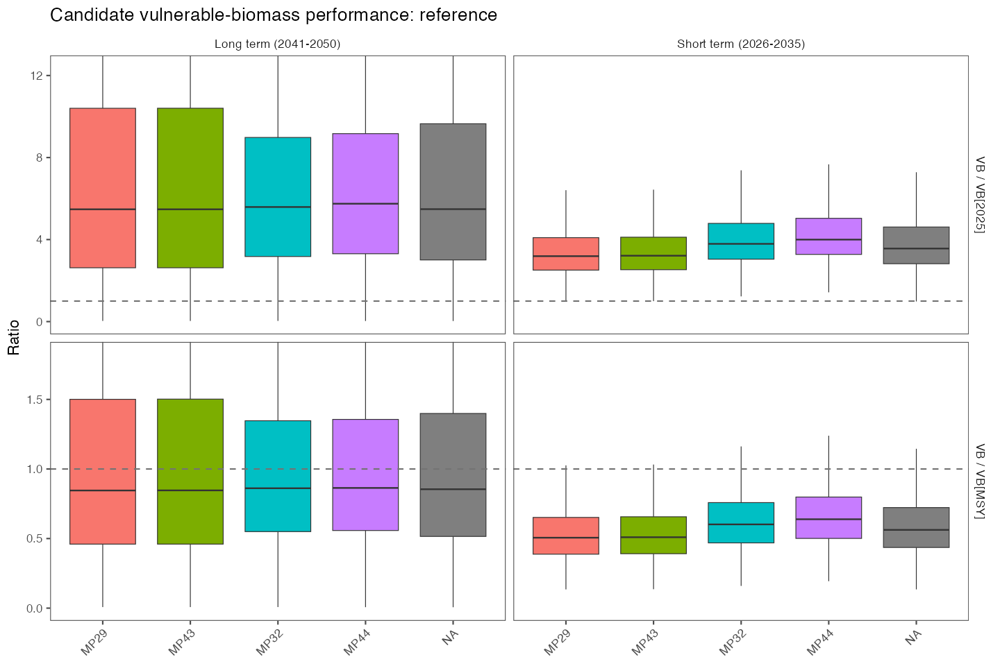
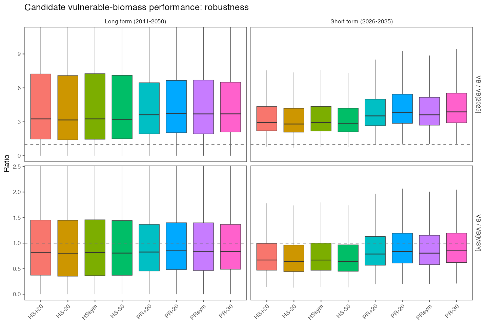
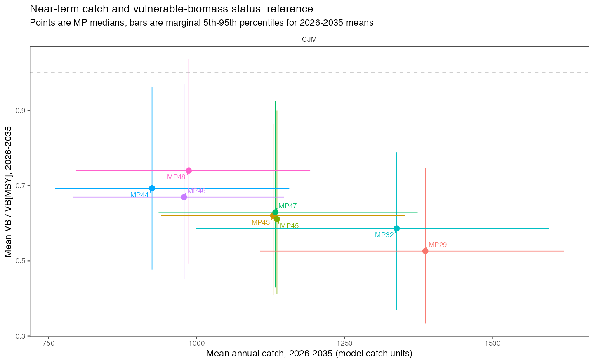
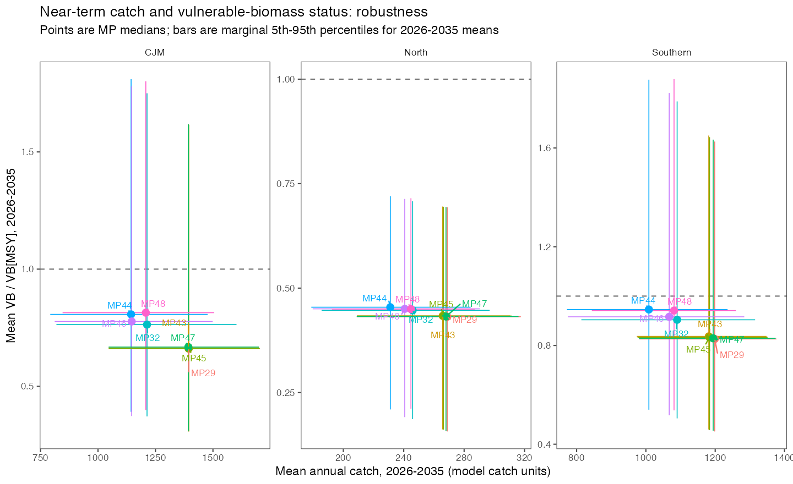
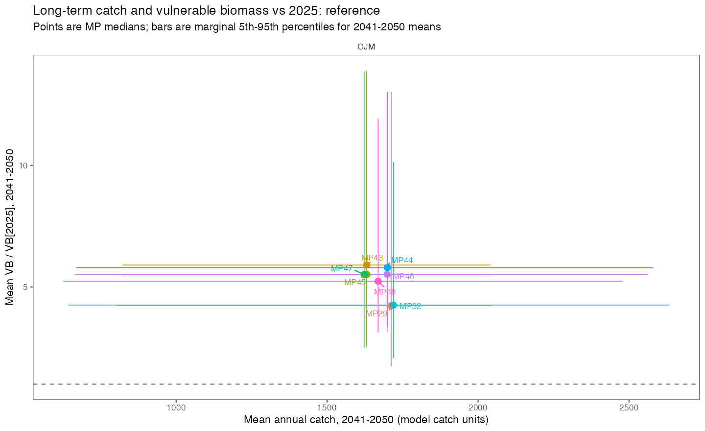
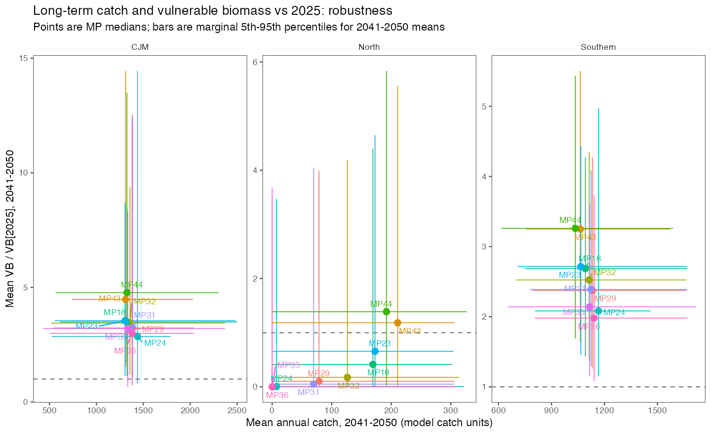
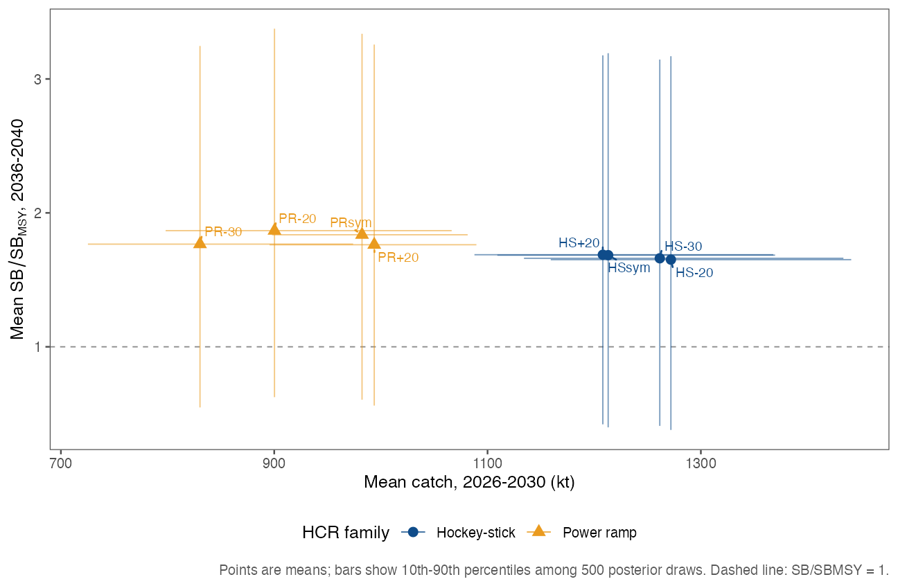
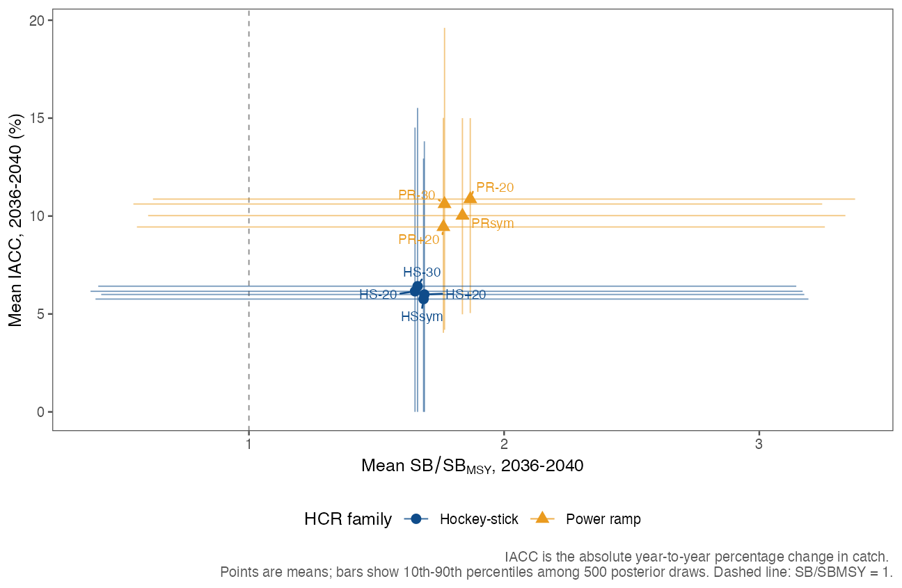
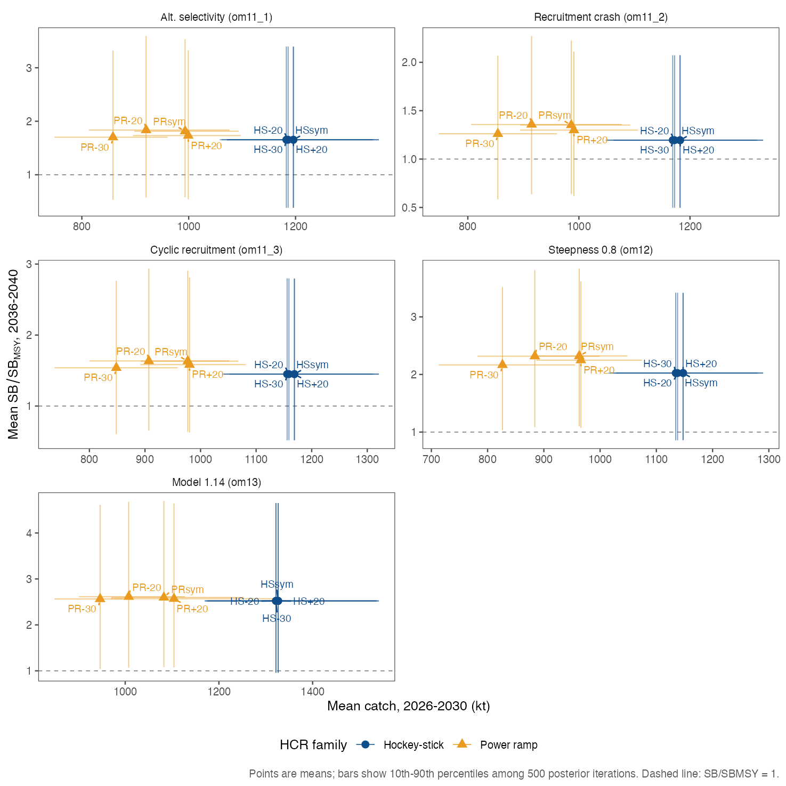
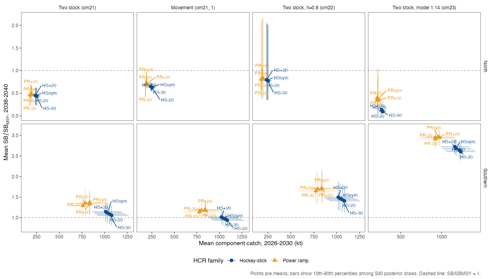



Jack Mackerel Management Strategy Evaluation: Synthesis for SC14

::: {.status-note}
**Status and purpose.** This report synthesizes the June 2026 SCW17 MSE
workshop, subsequent model and management-procedure development, the 24 July
task-team meeting, the 25 July progress presentation, and a draft weighted
scorecard. It provides a current technical synthesis for Scientific Committee
review. It does not record selection or adoption of a management procedure.
:::

## Executive summary {.unnumbered}

The jack mackerel MSE has progressed from a broad workshop design into a
narrower comparison of candidate management procedures (CMPs) tested against a
reference operating model (OM) and a structured set of robustness OMs. SCW17
established the principal design choices: simple and interpretable empirical
rules, simulation of correlated index errors, dynamic reference points,
explicit robustness testing, a broad performance-measure set, and development
of an exceptional-circumstances protocol. Post-workshop work corrected and
extended the implementation, tuned the leading rule families, and examined
their performance under one-stock and two-stock hypotheses, recruitment
stress, movement, selectivity, and alternative annual TAC-change limits.

Among the dozens of MPs evaluated at the SCW17 workshop, the analysts concluded
that the hockey-stick and power-ramp designs represented by these two CMPs,
together with reasonable variants of those designs, were suitable to carry
forward as proposals for consideration at SC14. This analytical conclusion
identifies a focused set for Scientific Committee consideration; it is not a
formal recommendation or adoption decision.

Two CMPs provide the central comparison:

- **HS+20** uses a hockey-stick harvest control rule (HCR), a 2,000-kt catch
  target, a 270-kt minimum, and a combined indicator from five standardized
  abundance indices.
- **PR+20** uses a power-ramp HCR, a 1,500-kt catch target, the same minimum and
  indicator, and a more responsive reduction in advice as the indicator
  declines.

Both were tuned under the reference OM to an approximately 60% mean probability
of dynamic Kobe-green status during 2041--2050. In the comparisons reviewed on
24 July, HS+20 generally provided higher short-term catch and lower interannual
catch variability, whereas PR+20 responded more quickly to declining indices
and showed comparatively stronger recovery under the recruitment-crash and
cyclic-recruitment scenarios. Differences were often modest, depended on the
OM and performance measure, and do not establish a preferred or "optimal" CMP.

The most consequential robustness finding came from the two-stock hypotheses.
Without movement, the southern component passed the agreed benchmark while the
northern component required an exploratory change of about 3.07 percentage
points in simulated catch distribution from north to south to reach the same
benchmark. This is a sensitivity result, not an allocation recommendation.
With movement, no tested fixed catch distribution achieved the long-term
benchmark for both components. Equal weighting of indices could also mask a
declining southern component when northern indices increased. Separate annual
tracking of northern and southern indices is therefore an important candidate
element of exceptional-circumstances monitoring.

The Scientific Committee is asked to consider the adequacy of HS+20 and PR+20 as
the central rule-shape comparison; the annual TAC-change variants to retain;
the role of all five indices, including the only fishery-independent series;
the interpretation of two-stock robustness; the use of final 500-replicate
runs; and the work needed to complete banking-and-borrowing and
exceptional-circumstances evaluation.

## Purpose, scope, and decision status

The MSE is intended to compare complete management procedures in a closed-loop
simulation before one is considered for implementation. Each CMP converts
agreed observations into annual catch advice; each OM represents a plausible
description of stock and fishery dynamics against which the CMP is tested.
Performance measures describe biological outcomes, yield, stability, and
fishery feasibility over specified periods.

This report melds the design record from the
[SCW17 MSE Workshop report](https://sprfmo.github.io/scw17/SCW17-MSE-Workshop-report.html)
with the post-workshop analysis summarized in the
[24 July task-team meeting report](https://sprfmo.github.io/jmMSE26/outputs/meeting-report-20260724/SC14_JM_MSE_meeting_report_2026-07-24.pdf)
and 25 July progress presentation. The sources have different roles:

| Source | Role in this synthesis |
|---|---|
| SCW17 workshop report, 15--19 June 2026 | Agreed MSE design, OM and CMP principles, reference-point approach, performance framework, and planned robustness work. |
| Post-workshop `jmMSE` analysis | Implemented CMP definitions, tuning runs, reference and robustness simulation outputs, and reproducibility records. |
| Task-team meeting, 24 July 2026 | Interpretation of results, wording cautions, issues for SC14, and agreed follow-up. |
| Progress presentation dated 25 July 2026 | Detailed tuning sequence, OM contrasts, and graphical robustness diagnostics available at the time of review. |
| Draft weighted scorecard, 23 July 2026 | Example of an editable multi-criteria comparison method; not an exhaustive candidate list, metric list, or decision. |

The Scientific Committee provides scientific advice and the Commission weighs
management trade-offs and makes management decisions. A shortlist in an MSE
analysis is not an adoption decision.

## Development from SCW17 to the current analysis

SCW17 continued work begun at SCW15 and the 2026 benchmark. It aimed to prepare
an OM set, trial CMPs, performance statistics, robustness scenarios, and
documentation for SC14. The workshop favored simple empirical rules because
they are transparent, reproducible, and can be locked before use. Trial CMPs
were used to learn about rule behavior and were not final recommendations.

Post-workshop work made the following material advances:

1. Index projection errors were extended to include iteration-specific
   variability, autocorrelation, and cross-correlation among index deviations.
2. Dynamic biological reference points and additional measures, including
   vulnerable-biomass and exploitation measures, were incorporated.
3. A straight-slope comparison rule was added.
4. The power-ramp implementation was corrected to remove discontinuities around
   its limit. The correction was required for consistent implementation but did
   not overturn the broad workshop conclusions.
5. A projected effort constraint was added to avoid implausible catches that
   would require extreme effort.
6. CMP tuning was performed as a nested screen of HCR family, catch target,
   minimum catch, index limit, index set, simulation replication, and robustness
   performance.
7. Alternative annual TAC-change limits were retuned instead of being compared
   using triggers tuned under a different constraint.

The 25 July presentation used the word "optimal" for some within-family runs.
The 24 July meeting clarified the interpretation: those runs were useful
within-family representatives, but the analysis does not establish an optimal
procedure across management objectives.

## Operating models and simulation methods

### Reference and robustness set

The current grid centers on the one-stock benchmark model `h1_0.16` with
steepness 0.65. Robustness OMs test major structural and parametric
uncertainties rather than assigning probability to one forecast.

| OM label | Main contrast | Analytical role |
|---|---|---|
| om11 | One stock, model 0.16, steepness 0.65 | Reference OM for current tuning |
| om11_1 | Alternative selectivity | Younger/smaller fish exposed to greater fishing pressure |
| om11_2 | One-year recruitment crash | Acute recruitment stress |
| om11_3 | Seven-year cyclic recruitment reduction | Prolonged recruitment stress |
| om12 | One stock, steepness 0.8 | Productivity robustness |
| om13 | One stock, SC13-era/model 1.14 configuration | Assessment/configuration robustness |
| om21 | Two stocks, no movement | Stock-structure and catch-distribution robustness |
| om21_1 | Two stocks with movement | Spatial redistribution and indicator-conflict robustness |
| om22 | Two stocks, steepness 0.8 | Two-stock productivity robustness |
| om23 | Two stocks, model 1.14 configuration | Two-stock assessment/configuration robustness |

The OM grid is not a declaration that all states are equally plausible. Its
purpose is to expose CMP sensitivity to assumptions that could matter to
management outcomes. Any later OM weighting should be explicit and documented.

### Recruitment, observation, and implementation uncertainty

Recruitment variability strongly influences stock trajectories and dynamic
reference points. The core simulations therefore retain recruitment
uncertainty, while discrete crash and cyclical-reduction cases act as stress
tests. SCW17 treated ENSO and climate effects as robustness questions at this
stage rather than embedding a single climate forecast in the core OM.

Each CMP receives simulated abundance indices rather than true stock status.
Projected index deviations include autocorrelation and cross-correlation so
that the observation model better represents the historical behavior of
multiple surveys and CPUE series. Simulation diagnostics should show the
distributions of index-error standard deviations, autocorrelation parameters,
and correlations used.

### Dynamic reference points

Environmental recruitment variability can make static reference points
misleading. SCW17 strongly recommended calculating the ratio
$B_{\mathrm{MSY}}/B_0$ within each MCMC draw, multiplying it by the
corresponding dynamic $B_0$, and evaluating spawning biomass relative to that
dynamic $B_{\mathrm{MSY}}$. The current tuning objective uses a dynamic
Kobe-green measure that combines biomass and fishing-pressure status.

Reference-point choices remain consequential. In particular, alternative
selectivity can change $F_{\mathrm{MSY}}$ and therefore
$F/F_{\mathrm{MSY}}$ even when biomass and catch trajectories are similar.
Interpretation should separate changes caused by reference-point definitions
from changes in underlying CMP behavior.

## Candidate management procedures

### Common indicator and annual calculation

The central CMPs use five observed series: northern Chile acoustic biomass,
Chilean CPUE, Peruvian artisanal and industrial indices, and offshore CPUE.
Each series is expressed relative to its 2019--2023 mean. The standardized
values are combined with equal weights within each year, and the CMP uses a
three-year recent average.

Most data are assumed to arrive with a one-year lag, while offshore CPUE has a
two-year lag. Under the tested timing, a calculation during 2026 for 2027
advice would use 2025 values for the acoustic, Chilean CPUE, and Peruvian
indices, and the 2024 offshore CPUE value. Same-year 2026 observations do not
enter that tested 2027 calculation unless the timing rule is explicitly
changed and re-evaluated.

### Naming convention and candidate variants

The working labels encode the HCR family and the most distinguishing annual
TAC-change constraint. `HS` means hockey-stick and `PR` means power ramp.
`+20` identifies the base 20% maximum increase, `-20` identifies the reverse
asymmetry with a 20% maximum decrease, `sym` identifies symmetric 15% limits,
and `-30` identifies a 30% maximum decrease. These labels should be used in
figures and interpretive prose. The legacy MP identifiers remain in the table
only to preserve the link to code, saved outputs, and earlier documents.

| Working label | HCR family | Maximum decrease | Maximum increase | Catch target or breakpoint (kt) | Tuned trigger | Legacy ID |
|---|---|---:|---:|---:|---:|---|
| HS+20 | Hockey-stick | 15% | 20% | 2,000 | 2.125 | MP29 |
| HS-20 | Hockey-stick | 20% | 15% | 2,000 | 3.0625 | MP43 |
| HSsym | Hockey-stick | 15% | 15% | 2,000 | 3.0625 | MP45 |
| HS-30 | Hockey-stick | 30% | 20% | 2,000 | 3.0625 | MP47 |
| PR+20 | Power ramp | 15% | 20% | 1,500 | 1.421875 | MP32 |
| PR-20 | Power ramp | 20% | 15% | 1,500 | 1.9140625 | MP44 |
| PRsym | Power ramp | 15% | 15% | 1,500 | 1.9375 | MP46 |
| PR-30 | Power ramp | 30% | 20% | 1,500 | 1.890625 | MP48 |

All eight rows use the same five-index mean, 2019--2023 reference period,
three-year averaging window, 270-kt minimum catch, 0.1 index limit, and 1,385-kt
initial simulated catch. The six non-base variants were retuned under the
reference OM after changing the annual constraint.

### Central rule-shape comparison

| Feature | HS+20 | PR+20 |
|---|---:|---:|
| HCR family | Hockey-stick | Power ramp |
| Catch target/breakpoint (kt) | 2,000 | 1,500 |
| Minimum catch (kt) | 270 | 270 |
| Index limit | 0.1 | 0.1 |
| Tuned trigger in 100-replicate comparison | 2.125 | 1.421875 |
| Maximum annual decrease | 15% | 15% |
| Maximum annual increase | 20% | 20% |
| Indices | All five | All five |

The hockey-stick increases advice linearly between the limit and trigger and
then reaches a plateau. The power ramp reduces catch more quickly when the
indicator is below its trigger and can continue to increase above its stated
breakpoint according to the implemented rule. These structural differences,
not the labels alone, create the main responsiveness-versus-stability contrast.

The progress presentation also reported separate 500-replicate tuning checks
for the central HS and PR configurations. Their triggers were close to the
100-replicate results, and the reported performance differences were small.
They are replication checks, not new conceptual CMPs. Final candidate summaries
should use the completed 500-replicate results when available.

### Annual TAC-change variants

The base CMPs limit annual advice to a 15% decrease and a 20% increase. The
task team identified a limited set of alternatives for retuning and
comparison:

| HCR family | Base | Reverse asymmetry | Symmetric | Larger decrease |
|---|---|---|---|---|
| Hockey-stick | HS+20: -15%/+20% | HS-20: -20%/+15% | HSsym: -15%/+15% | HS-30: -30%/+20% |
| Power ramp | PR+20: -15%/+20% | PR-20: -20%/+15% | PRsym: -15%/+15% | PR-30: -30%/+20% |

The variants change both management responsiveness and the tuned trigger.
They should therefore be compared as complete, retuned CMPs. The available
100-replicate reference and nine-OM robustness runs support exploratory
comparison; they do not replace final higher-replication evaluation of the
reduced set.

The following reference-OM plot shows 30 reproducibly selected simulation
iterations for the two hockey-stick asymmetry cases over 2025--2050. Iteration
IDs are paired exactly across panels: for example, iteration 6 would be shown
for both MPs if selected, and every selected ID occurs once in each panel.
Each iteration has its own line color, and the same iteration uses the same
color in both panels.
HS-20 is MP43 (`tun43`), with annual limits of -20%/+15%; HS+20 is MP29
(`tun29`), with limits of -15%/+20%. The vertically stacked panels share a
common catch scale. The selected IDs and a presence check for both runs are
saved in
[`catch_spaghetti_reference_iterations.csv`](../data/candidates/catch_spaghetti_reference_iterations.csv).

{#fig-catch-spaghetti fig-align="center" width="95%"}

### Choice of indices

A CPUE/fishery-index-only comparison was more responsive but produced slightly
lower short-term catch and higher short-term catch variability. The task team
retained all five indices for the current central comparison. The northern
Chile acoustic survey is the only fishery-independent abundance index in the
set and provides information that fishery-dependent series cannot fully
replace. Conversely, equal weighting across regions can become problematic if
northern and southern components diverge. These two findings support retaining
the acoustic series while also monitoring regional index groups separately.

## Performance evaluation and the draft scorecard

### Performance framework

SCW17 agreed that CMPs should be evaluated across safety, yield, stability,
and feasibility rather than by the tuning target alone. Tuning several CMPs to
the same Kobe-green objective makes that objective a control for comparison,
not a sufficient ranking statistic. The full performance framework can include:

- probabilities of dynamic Kobe-green, low biomass, overfishing, and stock
  collapse;
- spawning biomass, vulnerable biomass, and fishing pressure relative to
  reference points;
- short-, medium-, and long-term catch;
- interannual catch change and the frequency with which TAC-change limits bind;
- low-catch, minimum-catch, and fishery-shutdown-like outcomes;
- effort or catchability feasibility diagnostics; and
- robustness measures across individual OMs and stress tests.

A short headline table can aid Scientific Committee review, but the complete
metric set and underlying distributions should remain available in the
technical annex and interactive outputs.

The augmented candidate exports include vulnerable biomass relative to its
2025 level and relative to equilibrium vulnerable biomass at the fishing
mortality that produces MSY. The latter is a biomass-to-biomass ratio; it does
not divide vulnerable biomass by MSY catch.

{#fig-vb-reference fig-align="center" width="90%"}

{#fig-vb-robustness fig-align="center" width="90%"}

### Candidate performance quilt

The quilt below is an unweighted comparison of the eight annual-change
variants listed in the **Naming convention and candidate variants** table
under the reference OM. Annual values were averaged over 2041--2050 within each
simulation iteration; cell labels are medians of those iteration means. Color
is normalized independently within each metric across the eight variants.

Purple means lower relative preference and light lavender means higher relative
preference (0 is darkest; 1 is lightest). Higher
$SB/SB_{\mathrm{MSY}}$, catch, $VB/VB_{2025}$, and
$VB/VB_{\mathrm{MSY}}$ are treated as better; lower
$F/F_{\mathrm{MSY}}$ and lower IACC are treated as better. Lower
$F/F_{\mathrm{MSY}}$ represents lower fishing pressure, while catch is shown
separately. The within-column color scale is not an absolute biological or
management threshold and must not be interpreted as a rank or recommendation.

{#fig-candidate-quilt fig-align="center" width="95%"}

The underlying values, preferred directions, metric ranges, and normalized
scores are saved in
[`candidate_quilt_reference_summary.csv`](../data/candidates/candidate_quilt_reference_summary.csv).
An editable scorecard input layer is saved in
[`candidate_scorecard_input_reference.csv`](../data/candidates/candidate_scorecard_input_reference.csv).
It converts quilt relative preference to a 0--100 benefit score, records the preferred
direction and raw value, and supplies editable `include` and `weight` columns.
The default weight is one for every metric, but no weighted total is calculated
in this export. Changing weights or aggregating scores remains an explicit
user decision under the method below.

### Extensible weighted-scorecard method

The draft Excel scorecard demonstrates one transparent multi-criteria method:
for each included CMP and metric, observed values are rescaled from 0 to 100
according to whether higher or lower values are preferred; each normalized
value is multiplied by an editable weight; and the weighted values are summed
and divided by total weight. Equal-weight and biological-status-only views
provide simple sensitivity checks.

The current workbook is an **illustrative framework**, not the final scorecard.
Its example contains four CMPs and six performance columns because those values
were available when it was prepared. Both dimensions are expected to change:

- candidate rows can be added, removed, or replaced as the shortlist evolves;
- performance columns can be added as further safety, yield, stability,
  feasibility, and robustness metrics are validated;
- preferred direction, units, periods, transformation, and weight must be
  recorded for every metric; and
- normalization must be recalculated whenever the candidate set changes.

Min--max normalization is relative to the alternatives included. Adding or
removing a CMP can therefore change every normalized score even when underlying
MSE results do not change. Weights express management priorities and should be
agreed and recorded rather than presented as scientific constants. A weighted
score is a decision aid, not a recommendation, and should always be shown with
the underlying metric values and sensitivity analyses.

The draft example also includes a "green margin" based on mean biomass and
fishing-pressure ratios. That diagnostic is not the simulated probability of
being in the Kobe-green quadrant and must not replace the full-distribution MSE
probability metric.

## Main performance and robustness findings

### Reference comparison

Under the reference comparison reviewed by the task team:

- HS+20 generally produced higher short-term catch and lower interannual catch
  variability.
- PR+20 reduced advice more quickly as the index declined.
- Long-term differences were frequently smaller than the contrasts suggested
  by the HCR shapes alone.
- Neither CMP dominated across all biological, yield, and stability measures.

### Catch and vulnerable-biomass trade-offs

The near-term comparison uses mean annual catch and mean
$VB/VB_{\mathrm{MSY}}$ over 2026--2035. Points are MP medians and bars are
marginal 5th--95th percentiles.

{#fig-catch-vbmsy-reference fig-align="center" width="90%"}

{#fig-catch-vbmsy-robustness fig-align="center" width="90%"}

The long-term comparison uses mean annual catch and mean $VB/VB_{2025}$ over
2041--2050, with the same aggregation.

{#fig-catch-vb2025-reference fig-align="center" width="90%"}

{#fig-catch-vb2025-robustness fig-align="center" width="90%"}

### Preliminary catch--spawning-biomass trade-offs

The available saved results support a trial view of yield and spawning-biomass
trade-offs for the eight labelled annual-change configurations. The horizontal
axis is mean catch during 2026--2030. The vertical axis is the available
standardized spawning-biomass measure, mean $SB/SB_{\mathrm{MSY}}$ during
2036--2040. Points show means among 100 replicates, and horizontal and vertical
bars show the separate 10th--90th percentile ranges for the two measures.

{#fig-tradeoff-reference fig-alt="Near-term catch on the horizontal axis and mean spawning biomass relative to SBMSY on the vertical axis for eight HS and PR candidate configurations under the reference operating model."}

@fig-tradeoff-reference shows the reference-OM pattern. The less restrictive
base configurations lie toward higher near-term catch and lower later
$SB/SB_{\mathrm{MSY}}$, while variants allowing a larger annual decrease or
smaller annual increase generally shift toward lower near-term catch and higher
later biomass. The uncertainty ranges overlap substantially, so the plot should
not be read as a deterministic ranking.

{#fig-tradeoff-reference-iacc fig-alt="Mean spawning biomass relative to SBMSY on the horizontal axis and mean absolute interannual percentage change in catch on the vertical axis for eight HS and PR candidate configurations under the reference operating model."}

@fig-tradeoff-reference-iacc provides a complementary reference-OM view of
biological status and catch stability. The horizontal axis is the replicate
mean $SB/SB_{\mathrm{MSY}}$ during 2036--2040. The vertical axis is mean IACC
during the same period, where annual IACC is
$100|C_t/C_{t-1}-1|$: the plotted period therefore covers the five annual
changes from 2035--2036 through 2039--2040. Lower IACC indicates more stable
catch. Points are means among 100 replicates; horizontal and vertical bars are
the separate 10th--90th percentile ranges of the replicate-level period means.
As in @fig-tradeoff-reference, overlap is substantial and the marginal bars do
not show within-replicate covariance.

{#fig-tradeoff-single fig-alt="Five panels show near-term catch and later spawning biomass relative to SBMSY for eight HS and PR configurations under single-stock robustness operating models."}

The same broad direction is visible across the single-stock robustness cases
(@fig-tradeoff-single), but the location and separation of configurations
changes by OM. Recruitment stress reduces later biomass and changes the
apparent trade-off, while productivity and assessment-configuration
alternatives move both axes.

{#fig-tradeoff-two fig-alt="A grid of panels shows near-term component catch and later spawning biomass relative to SBMSY for northern and southern components under four two-stock operating models."}

For the two-stock cases (@fig-tradeoff-two), each row is a biological component
and the horizontal axis is **component catch**, not total catch. The plots
therefore diagnose stock-specific consequences and must not be interpreted as
an allocation comparison. They reinforce the need to keep northern and
southern outcomes separate.

These figures are preliminary for four reasons. First, they use the completed
100-replicate runs, not the planned final higher-replication comparison.
Second, the x and y uncertainty bars are marginal percentiles and do not show
the within-replicate covariance between plotted measures. Third, spawning
biomass is shown as a standardized dynamic-reference-point ratio rather than
in tonnes. Fourth, these views cover only selected yield, biological, and catch
stability periods; they do not include fishing pressure, Kobe-green
probability, low-catch risk, feasibility, or the other performance measures
needed for a decision. The plotted summary values are saved in
`doc/data/sc14-preliminary-tradeoffs.csv` and can be regenerated with
`R/plot_sc14_tradeoffs.R`.

### Recruitment stress

The discrete recruitment crash and seven-year cyclic reduction lowered
long-term catch and increased catch variability for both central CMPs. PR+20
responded more quickly and produced comparatively stronger long-term recovery
in these tests, while HS+20 retained the relative stability advantages seen in
the reference case. These are robustness contrasts, not forecasts that either
recruitment path will occur.

### Alternative selectivity

The alternative-selectivity OM exposed younger and smaller fish to greater
fishing pressure. Similar catch levels could then occur with lower spawning
biomass and poorer Kobe performance. HS+20 showed a somewhat better long-term
trade-off than PR+20 in the presented results, but differences were modest and
were affected by the changed $F_{\mathrm{MSY}}$ reference point.

### Two-stock hypotheses and catch distribution

In the two-stock OM without movement, the southern component remained above
the agreed benchmark while the northern component did not. An exploratory
shift of approximately 3.07 percentage points in simulated catch distribution
from north to south brought both components to the 60% long-term benchmark.
This illustrates sensitivity to spatial exploitation; it is not an allocation
or catch-distribution recommendation.

In the movement OM, biomass transferred from the southern to the northern
component. Because the five indices were combined with equal weights,
increasing northern indices could raise the overall indicator while southern
spawning biomass declined. No tested time-invariant catch distribution
resolved the long-term benchmark for both components. The test is deliberately
stressful and does not establish that this movement process is occurring.
It does establish a management-relevant warning signal: persistent divergence
between northern and southern indices.

## Banking, borrowing, and implementation constraints

SCW17 treated banking and borrowing as a sensitivity to apply to the final CMP
set rather than as feedback within the HCR. Ten-percent banking-and-borrowing
runs were still in progress at the 24 July meeting. The technical annex should
state whether the provision materially changes catch, stability, or biological
performance and whether its effect differs among CMPs.

Effort feasibility is another implementation constraint. A TAC can be
mathematically available but difficult to catch when fish distribution or
catchability changes. The OM includes an effort cap to prevent unrealistic
projected effort. Low realized catch, catch-rate proxies, and the frequency of
binding effort constraints should be retained as supporting diagnostics.

## Exceptional circumstances and annual monitoring

An exceptional-circumstances protocol should identify when new information is
inconsistent with the conditions under which a selected CMP performed
acceptably. SCW17 considered the ECP software framework as a proof of concept:
robustness simulations can identify data patterns associated with poor CMP
performance, and detection rules can then be evaluated for false-positive and
false-negative errors.

The current analysis identifies at least two monitoring priorities:

1. persistent divergence between northern and southern abundance indicators,
   particularly in relation to the two-stock-with-movement hypothesis; and
2. whether current survey, catch, and fishery information lies outside OM
   distributions or is associated with simulated CMP failure states.

Preliminary oral fishery updates reported at the 24 July meeting are not
validated data submissions and do not by themselves establish exceptional
circumstances. A protocol should specify the observations, data timing,
triggering evidence, review authority, possible responses, and return-to-rule
conditions before operational use.

## Matters for Scientific Committee consideration

The Scientific Committee may wish to:

1. Confirm whether HS+20 and PR+20 provide an adequate central comparison of HCR
   shape and management responsiveness.
2. Identify the annual TAC-change variants that merit final higher-replication
   evaluation, with a clear rationale from Commission requests and recorded
   management preferences.
3. Confirm the role of all five indices and the complementary value of the
   fishery-independent acoustic series.
4. Require separate presentation and annual tracking of northern and southern
   indicators alongside the combined CMP indicator.
5. Determine how the two-stock robustness results should inform evaluation of
   the southern component given separate northern monitoring and management.
6. Confirm that final candidate comparisons will use the completed
   500-replicate tuning and evaluation set.
7. Review banking-and-borrowing results and implementation-feasibility
   diagnostics when available.
8. Endorse development of a formal exceptional-circumstances protocol,
   including detection performance and pre-agreed responses.
9. Review and record the full performance-metric set and any weighting process,
   while retaining underlying outcomes rather than relying on a composite
   score alone.

## Work required before final advice

| Work item | Why it matters | Current status in source material |
|---|---|---|
| Complete final 500-replicate tuning and reduced-set evaluation | Stabilizes final reported triggers and performance distributions | Requested; 100-versus-500 checks showed small differences |
| Finalize TAC-change comparison | Tests responsiveness and stability under management-relevant constraints | Retuned 100-replicate reference and robustness variants available |
| Complete banking-and-borrowing sensitivity | Tests an implementation provision outside the HCR | Pending at 24 July meeting |
| Add index-error parameter distributions | Makes observation uncertainty auditable | Requested for technical annex |
| Improve index and HCR diagnostics | Clarifies responsiveness and the acoustic survey's role | Requested for technical annex |
| Finalize metric definitions and periods | Prevents ambiguous or directionally incorrect scoring | Full framework still being assembled |
| Expand and sensitivity-test the scorecard | Allows changing CMP and metric sets without implying a fixed ranking | Draft framework available |
| Specify exceptional-circumstances protocol | Defines detection, authority, response, and return to the CMP | Proof-of-concept stage |
| Freeze reproducible inputs and outputs | Supports independent review and exact reruns | Run records exist; final archive still required |

## Source, terminology, and interpretation notes

This synthesis uses "CMP" for a procedure still under evaluation and "MP" when
referring to the identifiers used in the analysis. "Catch distribution" is
used for two-stock sensitivity tests; those tests are not allocation advice.
"Dynamic Kobe green" refers to performance calculated using the dynamic
reference-point implementation described above.

Numerical values from presentations and meeting materials should be checked
against the frozen final simulation archive before submission. Where a
presentation takeaway and the later meeting interpretation differed in tone,
this report follows the meeting's more cautious interpretation. The meeting
report itself was prepared from meeting notes, transcript material, and an
automated meeting summary; preliminary oral information requires confirmation
against formal submissions.

## Sources

- SPRFMO Jack Mackerel Working Group. 2026.
  [Report of the Jack Mackerel Management Strategy Evaluation Workshop -
  SCW17](https://sprfmo.github.io/scw17/SCW17-MSE-Workshop-report.html),
  15--19 June 2026, updated 7 July 2026.
- SPRFMO Jack Mackerel MSE Task Team. 2026. *Meeting report: Candidate
  management procedures, robustness testing, and SC14 preparation*, meeting
  held 24 July 2026. Draft for member review.
- Mosqueira, I., and B. Bergès. 2026. *Management Strategy Evaluation (MSE)
  for SPRFMO jack mackerel: Progress since SCW17*. Presentation dated 25 July
  2026.
- `jmMSE` candidate definitions, run settings, performance tables, and saved
  reference and robustness runs used by the current candidate documentation.
- *Candidate Management Procedure Weighted Scorecard*, draft workbook dated
  23 July 2026. Illustrative and extensible; candidate and metric coverage is
  incomplete.
