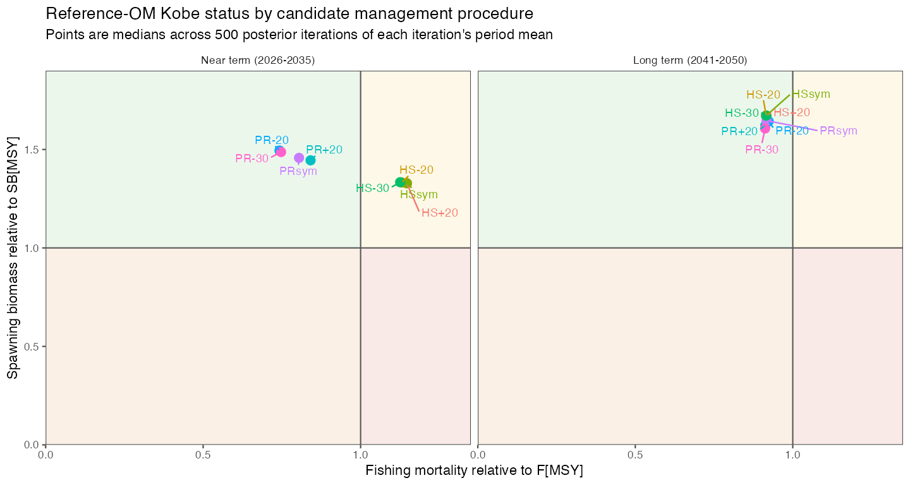
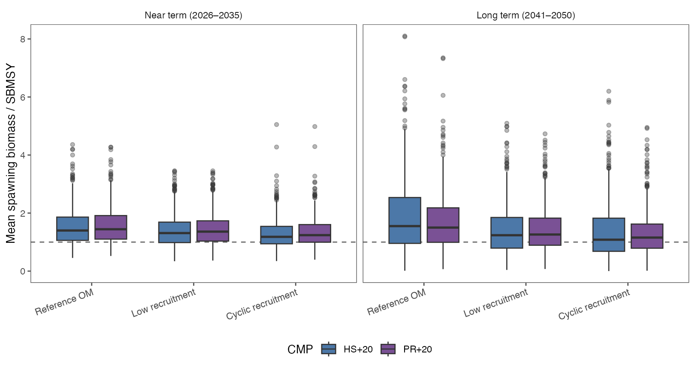
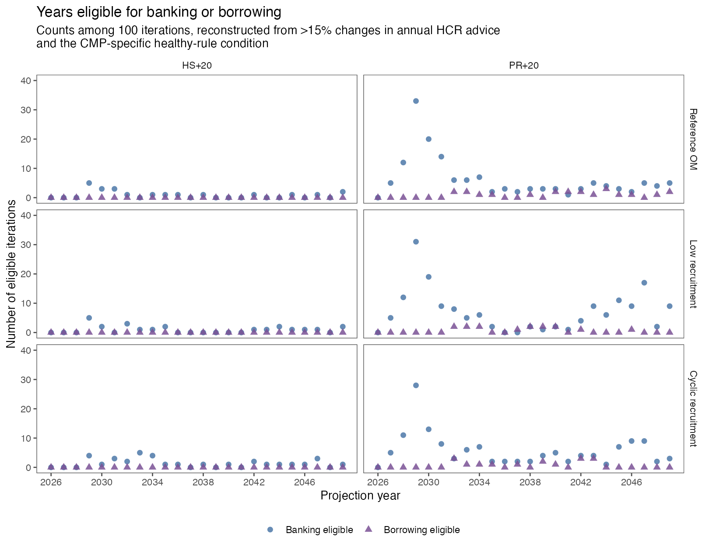



::: {.content-visible when-format="html"}
[Download the PDF version](sc14-mse-report.pdf){.btn .btn-primary}
:::

<div class="paper-title">Jack Mackerel Management Strategy Evaluation: Synthesis for SC14</div>

::: {.content-visible when-format="html"}
```{=html}
<div id="sc14-release-stamp" class="draft-stamp" aria-label="Report release candidate and date"></div>
<script>
(() => {
  const source = document.querySelector("#title-block-header .date");
  const target = document.getElementById("sc14-release-stamp");
  if (source && target) target.textContent = source.textContent.trim();
})();
</script>
```
:::

::: {.status-note}
**Status and purpose.** This is a working pre-submission revision based on the
scientific outputs frozen in `SC14-MSE-2026-RC1`. The revised documents and
new review-evidence tables are not part of that fingerprinted release; they
require a new release candidate after review. The report synthesizes the June
2026 SCW17 MSE workshop and subsequent model and management-procedure
development.
:::

## Executive summary {.unnumbered}

The jack mackerel MSE has progressed from a broad workshop design into a
narrower comparison of candidate management procedures (CMPs) tested against a
reference operating model (OM) and a structured set of robustness OMs. SCW17
established the principal design choices: simple and interpretable empirical
rules, simulation of correlated index errors, dynamic reference points,
explicit robustness testing, a broad performance-measure set, and development
of an exceptional-circumstances protocol. Post-workshop work corrected and
extended the implementation, tuned the leading rule families, and examined
their performance under one-stock and two-stock hypotheses, recruitment
stress, movement, selectivity, and alternative annual TAC-change limits.

A novel feature of this MSE is its treatment of the five abundance indicators
as related observations rather than independent sources of information. The OMs
simulate their observation errors jointly using historical estimates of each
series' uncertainty, temporal autocorrelation, and cross-correlation. This
allows the evaluation to represent shared movements among indicators,
including correlation that may arise when the population shifts spatially.
The estimated correlation structure used for the reference OM is illustrated
in @fig-om11-index-error-correlations.

Among the dozens of MPs evaluated at the SCW17 workshop, the analysts concluded
that the hockey-stick and power-ramp designs represented by these two CMPs,
together with reasonable variants of those designs, were suitable to carry
forward as proposals for consideration at SC14. This analytical conclusion
identifies a focused set for Scientific Committee consideration; it is not a
formal recommendation or adoption decision.

The [main Jack Mackerel MSE resource
page](https://sprfmo.github.io/jmMSE26/) describes the naming conventions and
how the MSE components fit together, and provides the CMP and OM registries and
translation tables linking the labels used across analyses and reports.

Two CMPs are the focal cases for the current comparison:

- **HS-20 (MP43)** uses a hockey-stick harvest control rule (HCR), a 2,000-kt
  catch target, a 270-kt minimum, and annual limits of a 20% decrease and 15%
  increase.
- **PR-20 (MP44)** uses a power-ramp HCR, a 1,500-kt catch target, the same
  minimum, and the same annual limits, with a more responsive reduction in
  advice as the indicator declines, and the ability to increase catches above
  the target level.

Both use the combined indicator assembled from five standardized abundance indices.
The earlier **HS+20 (MP29)** and **PR+20 (MP32)** specifications are retained
as sensitivity cases. They arose from an initial request informed by early
feedback from Chile's internal MSE research project; their 20% maximum annual
TAC increase was not selected from the later Commission poll. That poll helped
inform the broader set of annual TAC-change variants examined here. The
remaining **HSsym**, **HS-30**, **PRsym**, and **PR-30** procedures are
additional comparison cases. The paired catch trajectories for focal HS-20
and sensitivity HS+20 illustrate one annual-limit contrast in
@fig-catch-spaghetti.

The scorecard is retained as a preliminary sensitivity tool rather than an
executive ranking. Its ordering changes with the candidate set, metrics,
directions, scaling, and weights; it does not determine biological
acceptability, focal status, or a shortlist. Raw outcomes, uncertainty, and
performance under individual OMs remain the primary evidence.

All eight CMPs were refined against the same 500 posterior draws to target an
approximately 60% mean probability of dynamic Kobe-green status during
2041--2050. Their realized probabilities range from 59.2% to 61.0%, so the
comparison is now like-for-like with respect to the tuning objective. The
archived 100-draw results remain useful provenance but are superseded by the
500-draw reference and robustness results used throughout this report. The
earlier comparisons reviewed on 24 July identified a broad contrast between
the stability of the hockey-stick family and the stronger response of the
power-ramp family as indicators declined. The completed results refine that
comparison across all eight CMPs; differences depend on the OM and performance
measure and do not establish a preferred or "optimal" CMP.

The most consequential robustness finding came from the two-stock hypotheses.
Without movement, the southern component passed the agreed benchmark while the
northern component required an exploratory change of ~3% in simulated catch
distribution from north to south to reach the same
benchmark. This is a sensitivity result, not an allocation recommendation.
With movement, no tested fixed catch distribution achieved the long-term
benchmark for both components. Equal weighting of indices could also mask a
declining southern component when northern indices increased. Separate annual
tracking of northern and southern indices is therefore an important candidate
element of exceptional-circumstances monitoring.

The Scientific Committee is asked to consider the adequacy of HS-20 (MP43) and
PR-20 (MP44) as the focal cases; the role of HS+20 (MP29) and PR+20 (MP32) as
sensitivity cases; the other annual TAC-change variants to retain;
the role of all five indices, including the only fishery-independent series;
the interpretation of two-stock robustness; the completed 500-draw reference
and robustness evaluation; and the work needed
to validate and complete banking-and-borrowing and
exceptional-circumstances evaluation.

## Purpose, scope, and decision status

The MSE is intended to compare complete management procedures in a closed-loop
simulation before one is considered for implementation. Each CMP converts
agreed observations into annual catch advice; each OM represents a plausible
description of stock and fishery dynamics against which the CMP is tested.
Performance measures describe biological outcomes, yield, stability, and
fishery feasibility over specified periods.

This report melds the technical foundation assembled in the
[benchmark-preparation and MSE-planning materials](https://sprfmo.github.io/JM_SCW_prep/),
the design record from the
[SCW17 MSE Workshop report](https://sprfmo.github.io/scw17/SCW17-MSE-Workshop-report.html),
and the post-workshop analysis summarized in the
[final 24 July task-team meeting report](https://sprfmo.github.io/jmMSE26/outputs/meeting-report-20260724/SC14_JM_MSE_meeting_report_2026-07-24.pdf)
and the [presentation from Wageningen Marine Research consultants
(WUR)](presentation_20260725.pdf).
The preparation site preceded SCW17 and
provided the detailed model specifications, diagnostics, working papers, and
technical discussions needed to update the operating models used at SCW17 and
in subsequent MSE work. Their different roles are summarized in
@tbl-source-roles.

| Source | Role in this synthesis |
|:---|:---|
| [Benchmark preparation and MSE planning](https://sprfmo.github.io/JM_SCW_prep/) | Pre-SCW17 benchmark papers, OM specifications, diagnostics, index analyses, and preparatory meeting records that supported updates to the OMs used at SCW17 and beyond. |
| [SCW16 benchmark report](https://sprfmo.github.io/JM_SCW_prep/JMWG-Benchmark-Meeting-report-2026.html) | Formal record of the May 2026 benchmark review, including assessment inputs, abundance indices, biological assumptions, model alternatives, decisions, and uncertainties to carry into OM conditioning. |
| [SCW17/Paper-01: Model developments](https://sprfmo.github.io/scw17/SCW17-Paper-01-ModelDevelopments.html) | Post-SCW16, pre-SCW17 bridge from the benchmark model sequence to the `0.15` and `0.16` configurations considered for MSE conditioning, with model comparisons and diagnostics. |
| SCW17 workshop report, 15--19 June 2026 | Agreed MSE design, OM and CMP principles, reference-point approach, performance framework, and planned robustness work. |
| Post-workshop `jmMSE` analysis | Implemented CMP definitions, tuning runs, reference and robustness simulation outputs, and reproducibility records. |
| Task-team meeting, 24 July 2026 | Interpretation of results, wording cautions, issues for SC14, and agreed follow-up. |
| [July WUR presentation](presentation_20260725.pdf) | Detailed tuning sequence, OM contrasts, and graphical robustness diagnostics available at the time of review. |
| Draft weighted scorecard, 23 July 2026 | Example of an editable multi-criteria comparison method; not an exhaustive candidate list, metric list, or decision. |

: Source materials and their roles in this synthesis. {#tbl-source-roles}

The Scientific Committee provides scientific advice and the Commission weighs
management trade-offs and makes management decisions. A shortlist in an MSE
analysis is not an adoption decision.

## Development from SCW17 to the current analysis

SCW17 continued work begun at the
[2025 SCW15 MSE workshop](https://sprfmo.github.io/SCW15_report/)
[@sprfmo2025scw15] and the 2026 benchmark. The
[benchmark-preparation and MSE-planning site](https://sprfmo.github.io/JM_SCW_prep/)
preserves the detailed model specifications, diagnostics, index working
papers, and preparatory meeting discussions that preceded SCW17. That record
provided the technical basis for updating the operating models taken into the
workshop and used in subsequent MSE analyses.

SCW17 aimed to prepare an OM set, trial CMPs, performance statistics,
robustness scenarios, and documentation for SC14. The workshop favored simple
empirical rules because they are transparent, reproducible, and can be locked
before use. Trial CMPs were used to learn about rule behavior and were not
final recommendations.

Post-workshop work made the following material advances:

1. Index projection errors were extended to include iteration-specific
   variability, autocorrelation, and cross-correlation among index deviations.
2. Dynamic biological reference points and additional measures, including
   vulnerable-biomass and exploitation measures, were incorporated.
3. A straight-slope comparison rule was added.
4. The power-ramp implementation was corrected to remove discontinuities around
   its limit. The correction was required for consistent implementation but did
   not overturn the broad workshop conclusions.
5. A projected effort constraint was added to avoid implausible catches that
   would require extreme effort increases from current levels.
6. CMP tuning was performed as a nested screen of HCR family, catch target,
   minimum catch, index limit, index set, simulation replication, and robustness
   performance.
7. Alternative annual TAC-change limits were retuned instead of being compared
   using triggers tuned under a different constraint.

The development of vulnerable-biomass performance indicators responded to a
request from SCW17 for a measure that could complement spawning biomass and be
more relatable to fishers. In this context, vulnerable biomass represents the
fish available to the fishing fleet under the modeled selectivity. It was
therefore developed as a fishery-facing performance measure, while spawning
biomass remains the principal measure of reproductive stock condition.

The July WUR presentation used the word "optimal" for some within-family runs.
The 24 July meeting clarified the interpretation: those runs were useful
within-family representatives, but the analysis does not establish an optimal
procedure across management objectives.

The sequence from the workshop trials to the current comparison is recorded in
[`candidate-development-history.csv`](../data/candidate-development-history.csv).
The workshop `run18`/`run20`/`run22` subset is an antecedent development set,
not a one-to-one renaming of MP29/MP32 or MP43--MP48. The annual-limit variants
were added after the 24 July meeting and remain analyst-developed comparison
cases awaiting Task Team and Scientific Committee review.

```{r}
#| label: tbl-candidate-history
#| tbl-cap: "Development and decision status of the current CMP comparison."
#| echo: false

candidate_history <- read.csv("../data/candidate-development-history.csv",
  stringsAsFactors = FALSE, check.names = FALSE)
knitr::kable(candidate_history[c("stage", "date", "identifiers",
  "material_change", "decision_status")],
  col.names = c("Stage", "Date", "Identifiers", "Material change",
    "Decision status"))
```

## Operating models and simulation methods

### Reference and robustness set

The operating-model set did not begin at SCW17. The
[SCW16 benchmark workshop report](https://sprfmo.github.io/JM_SCW_prep/JMWG-Benchmark-Meeting-report-2026.html)
records the 18--22 May 2026 review of assessment inputs, abundance indices,
biological assumptions, assessment-model alternatives, and priorities for OM
conditioning [@sprfmo2026benchmark]. It is the benchmark decision record that
defined the assessment foundation and identified which uncertainties should be
fixed, retained as OM axes, or examined diagnostically.

Following SCW16 and before the SCW17 workshop, the working group prepared
[SCW17/Paper-01: Model developments](https://sprfmo.github.io/scw17/SCW17-Paper-01-ModelDevelopments.html)
[@sprfmo2026modeldevelopments]. That paper explicitly bridged the SCW16
baseline (`0.00`) and proposed final benchmark configuration (`0.14`) to the
post-benchmark `0.15` and `0.16` developments. It documented the revised
treatment of the Peruvian artisanal and industrial CPUE series, the change to
the two-stock productivity-regime specification in `0.16`, comparisons with
the benchmark anchor models, and diagnostics for the configurations presented
for MSE conditioning. SCW17 subsequently used `h1_0.16` as the primary basis
for CMP testing, retained the matching two-stock configuration for structural
robustness, and retained the SC13-era `0.00`/`1.14` configuration as an
assessment/configuration robustness case. Thus, the current OM set should be
read as the product of the SCW16 benchmark followed by a documented
post-benchmark model-development step, rather than as a set first defined at
SCW17.

The current grid centers on the one-stock benchmark model `h1_0.16` with
steepness 0.65. Robustness OMs test major structural and parametric
uncertainties rather than assigning probability to one forecast
(@tbl-om-set).

| OM label | Main contrast | Analytical role | Proposed decision treatment |
|:---|:---|:---|:---|
| om11 | One stock, model 0.16, steepness 0.65 | Reference OM for current tuning | Primary comparison; not assigned a numerical plausibility weight |
| om11_1 | Alternative selectivity | Younger/smaller fish exposed to greater fishing pressure | Structural sensitivity that may affect reference-point interpretation |
| om11_2 | One-year recruitment crash | Acute recruitment stress | Stress test; concern should be reported rather than silently pooled |
| om11_3 | Seven-year cyclic recruitment reduction | Prolonged recruitment stress | Stress test; concern should be reported rather than silently pooled |
| om12 | One stock, steepness 0.8 | Productivity robustness | Parameter sensitivity |
| om13 | One stock, SC13-era/model 1.14 configuration | Assessment/configuration robustness | Legacy-configuration sensitivity |
| om21 | Two stocks, no movement | Stock-structure and catch-distribution robustness | Structural sensitivity requiring component-level results |
| om21_1 | Two stocks with movement | Spatial redistribution and indicator-conflict robustness | Difficult structural case requiring an explicit SC14 judgment |
| om22 | Two stocks, steepness 0.8 | Two-stock productivity robustness | Structural and parameter sensitivity requiring component-level results |
| om23 | Two stocks, model 1.14 configuration | Two-stock assessment/configuration robustness | Difficult legacy-configuration case requiring an explicit SC14 judgment |

: Reference and robustness operating-model set. {#tbl-om-set}

The OM set (reference and robustness) is not a declaration that all states are
equally plausible. No numerical plausibility weights have been agreed. The
proposed treatments above keep the reference comparison, structural
sensitivities, and deliberate stress tests distinct while bringing difficult
results forward. SC14 should decide whether any case is exclusionary, a source
of concern, or informative but non-decisive; any later OM weighting must be
explicit and documented.

### Recruitment, observation, and implementation uncertainty

Recruitment variability strongly influences stock trajectories and dynamic
reference points. The core simulations therefore retain recruitment
uncertainty, while discrete crash and cyclical-reduction cases act as stress
tests. SCW17 treated ENSO and climate effects as robustness questions at this
stage rather than embedding a single climate forecast in the core OM.

### Dynamic reference points

Environmental recruitment variability can make static reference points
misleading. In [paragraph 58 of the SCW17 workshop
report](https://sprfmo.github.io/scw17/SCW17-MSE-Workshop-report.html#reference-points-and-kobe-plot-summaries),
the Working Group strongly recommended calculating the ratio
$B_{\mathrm{MSY}}/B_0$ within each MCMC draw, multiplying it by the
corresponding dynamic $B_0$, and evaluating spawning biomass relative to that
dynamic $B_{\mathrm{MSY}}$. The current tuning objective uses a dynamic
Kobe-green measure that combines biomass and fishing-pressure status.

Reference-point choices remain consequential. In particular, alternative
selectivity can change $F_{\mathrm{MSY}}$ and therefore
$F/F_{\mathrm{MSY}}$ even when biomass and catch trajectories are similar.
Interpretation should separate changes caused by reference-point definitions
from changes in underlying CMP behavior.

### Generating OM data indices

Each CMP receives simulated abundance indices rather than true stock status.
Projected index deviations include autocorrelation and cross-correlation so
that the observation model represents the estimated historical behavior of
multiple surveys and CPUE series. The final values and data coverage used by
the reference OM are reported below.

The combined indicator does not assume that five series provide five
independent confirmations of stock change. In each OM iteration, projected
index errors are generated jointly from the historical index deviations:
series-specific log-scale standard deviations describe uncertainty, lag-1
parameters preserve temporal autocorrelation, and an iteration-specific
correlation matrix preserves cross-correlation among indices. These
relationships matter because common environmental effects, fleet behavior,
and spatial redistribution of the population can cause several indices to
rise or fall together.

For index $i$ in year $t$, the log deviation follows
$x_{i,t}=\rho_i x_{i,t-1}+\epsilon_{i,t}$ and the multiplicative observation
deviation is $\exp(x_{i,t})$. The innovation covariance is constructed from
the iteration-specific marginal log-scale standard deviations, lag-1
coefficients, and historical cross-correlation matrix. The implementation
adjusts the innovation correlation for the AR(1) coefficients and applies a
nearest-positive-definite correction before Cholesky simulation when needed.
Parameters are estimated separately within each posterior iteration from the
available historical index deviations through 2025; @tbl-index-error-parameters
shows their means across iterations.

```{r}
#| label: tbl-index-error-parameters
#| tbl-cap: "OM11 index-error parameters and historical coverage used for projection."
#| echo: false

index_parameters <- read.csv("../data/index-error-parameters.csv",
  stringsAsFactors = FALSE, check.names = FALSE)
index_parameters$sd <- round(index_parameters$sd, 3)
index_parameters$rho <- round(index_parameters$rho, 3)
knitr::kable(index_parameters[c("index", "first_year", "last_year",
  "years_with_data", "sd", "rho")],
  col.names = c("Index", "First year", "Last year", "Years with data",
    "Mean log SD", "Mean lag-1 rho"), row.names = FALSE)
```

The five series overlap completely only during 2008--2009, 2011--2014, and
2018--2021. The northern Chile acoustic series has earlier and intermittent
coverage, including no 2022 value; the Peruvian industrial series has four
historical gaps; and offshore CPUE ends in 2024. These gaps are retained in
the estimation data rather than silently filled. The full mean correlation
matrix is downloadable as
[`index-error-correlations.csv`](../data/index-error-correlations.csv), and the
complete gap list, coverage, and parameter values are in
[`index-error-parameters.csv`](../data/index-error-parameters.csv).

{#fig-om11-index-error-correlations fig-align="center" width="88%" fig-alt="Correlation-matrix heat map for the five OM11 abundance indices. Cells show the posterior-iteration mean correlation and standard deviation. The largest positive off-diagonal correlation is 0.54 between the Peru artisanal and Peru industrial indices."}

As shown in @fig-om11-index-error-correlations, the estimated relationships are
neither uniformly positive nor interchangeable. For example, the Peru
artisanal and industrial indices have the strongest positive mean
cross-correlation (0.54), whereas several relationships involving the offshore
CPUE series are weakly negative. The standard deviations in parentheses show
that the observation-error correlation matrix also varies among OM
iterations.

The resulting closed-loop test therefore exposes the CMP to realistic
combinations of agreement, redundancy, and divergence among indicators. The
novelty lies in evaluating the simple, transparent equal-weight composite
under this estimated multivariate observation process; equal weighting itself
is not covariance weighting and does not mathematically remove correlation.
This approach is consistent with the MSE best-practice principle that
management procedures should be tested using simulated management data that
represent observation uncertainty rather than receiving true stock status
[@punt2016mse].

This model covers stochastic marginal error, persistence, cross-series
correlation, and posterior variation in those estimates. It does **not** by
itself represent gradual catchability drift, abrupt re-standardization,
revised historical data, systematic regional imbalance, or reliability-based
index weighting. Tests of those mechanisms, missing-survey rules, and
region-balanced or reliability-weighted indicators remain continuing work.

## Candidate management procedures

### Common indicator and annual calculation

The central CMPs use five observed series: northern Chile acoustic biomass,
Chilean CPUE, Peruvian artisanal and industrial indices, and offshore CPUE.
Each series is expressed relative to its 2019--2023 mean. The standardized
values are combined with equal weights within each year, after the OMs have
generated the indices using estimated uncertainty, temporal autocorrelation,
and cross-correlation among series. The CMP then uses a three-year recent
average of the combined indicator.

Most data are assumed to arrive with a one-year lag, while offshore CPUE has a
two-year lag. Under the tested timing, a calculation during 2026 for 2027
advice would use 2025 values for the acoustic, Chilean CPUE, and Peruvian
indices, and the 2024 offshore CPUE value. Same-year 2026 observations do not
enter that tested 2027 calculation unless the timing rule is explicitly
changed and re-evaluated, and observations were known to be available in time.

### Naming convention and candidate variants

The working labels encode the HCR family and the most distinguishing annual
TAC-change constraint. `HS` means hockey-stick and `PR` means power ramp.
`+20` identifies the base 20% maximum increase, `-20` identifies the reverse
asymmetry with a 20% maximum decrease, `sym` identifies symmetric 15% limits,
and `-30` identifies a 30% maximum decrease. These labels should be used in
figures and interpretive prose. The legacy MP identifiers remain in the table
only to preserve the link to code, saved outputs, and earlier documents.
The complete mapping is given in @tbl-candidate-variants.

### Focal cases and annual-limit sensitivities

All eight CMPs use the same five-index mean, 2019--2023 reference period,
three-year averaging window, 270-kt minimum catch, 0.1 index limit, and
1,385-kt initial simulated catch. Each variant was refined under the reference
OM using the same 500 posterior draws after setting its annual constraint.

The nested development framework in @fig-nested-cmp-development shows how the
focused comparison was constructed: first select the HCR shape, then its target
catch, and finally tune the trigger controlling the indicator-to-catch
response, while retaining the common minimum catch and index limit. The figure
records the earlier 100-draw trigger controls used during development; the
subsequent common 500-draw refinement used for current results is reported in
@tbl-candidate-variants.

{#fig-nested-cmp-development fig-align="center" width="100%" fig-alt="Flow diagram showing how the CMP comparison narrows from two harvest-control-rule families to hockey-stick and power-ramp targets, common minimum and limit settings, and the eight annual-change variants used in the 500-draw comparison."}

The matched example in @fig-hcr-shape-comparison isolates the effect of HCR
shape by assigning both rules the same minimum, target, limit, and trigger. The
hockey-stick increases catch advice linearly and then remains at its target.
The power ramp is more conservative below the trigger but continues above the
target when the index exceeds the trigger. Its second panel illustrates the
harvest-rate pattern that would follow **if** vulnerable biomass were directly
proportional to the index. For both HCR forms, the implied harvest rate rises
at low stock sizes because catch advice is not allowed to fall below the
270-kt minimum; that fixed catch floor becomes an increasing proportion of the
vulnerable biomass as stock size declines. The panel is explanatory rather
than an estimated performance result or an additional rule used by the CMPs.

{#fig-hcr-shape-comparison fig-align="center" width="100%" fig-alt="Two matched panels compare hockey-stick and power-ramp catch advice against the relative index, plus their conceptual implied harvest rates. The hockey-stick becomes flat at its target, while the power ramp continues increasing above its trigger."}

```{=latex}
\begingroup\small
```

```{r}
#| label: tbl-candidate-variants
#| tbl-cap: "Naming convention, legacy identifiers, and definitions of the eight candidate variants."
#| echo: false

cmp_registry <- read.csv("../data/cmp-registry.csv",
  stringsAsFactors = FALSE, check.names = FALSE)
cmp_registry <- cmp_registry[tolower(cmp_registry$sc14_release) == "yes", ]
fmt_number <- function(x) format(x, scientific = FALSE, trim = TRUE,
  digits = 12)
cmp_table <- data.frame(
  `Working label` = cmp_registry$label,
  `Legacy ID` = cmp_registry$cmp_id,
  `HCR family` = ifelse(grepl("hockeystick", cmp_registry$hcr),
    "Hockey-stick", "Power ramp"),
  `Target or breakpoint (kt)` = format(cmp_registry$target,
    big.mark = ",", scientific = FALSE, trim = TRUE),
  `Tuned trigger` = vapply(cmp_registry$trigger, fmt_number, character(1)),
  `Annual decrease/increase limits` = paste0(
    "-", round(100 * (1 - cmp_registry$dlow)), "% / +",
    round(100 * (cmp_registry$dupp - 1)), "%"),
  check.names = FALSE
)
knitr::kable(cmp_table, align = c("l", "l", "l", "r", "r", "r"))
```

```{=latex}
\endgroup
```

The 500-draw refinement began from the earlier 100-draw tuned controls rather
than restarting from a broad search. It then evaluated nearby trigger values
under one saved OM and common random-number configuration. The resulting
dynamic Kobe-green probabilities for HS+20, HS-20, HSsym, HS-30, PR+20,
PR-20, PRsym, and PR-30 are 61.0%, 59.2%, 60.4%, 60.4%, 60.3%, 59.8%, 59.5%,
and 60.6%, respectively.

A completed local trigger check tested one grid step below and above every
selected control using the same saved 500 draws. The steps were 0.0625 for
the hockey-stick rules and 0.03125 for the power-ramp rules, matching the final
bisection resolution for each family. All eight checks behaved as expected:
a higher trigger produced a higher long-term Kobe-green probability and a
lower trigger produced a lower probability. Across the eight CMPs, one lower
step changed the probability by -1.36 to -1.74 percentage points and one upper
step changed it by +1.10 to +1.84 points. In plain language, this is a local
tolerance profile: it checks how much the tuning result changes after a small
move on either side of the chosen trigger, rather than assuming the selected
number is uniquely precise. The full values are saved in the
[trigger-tolerance summary](../data/candidates/trigger_tolerance_summary_500.csv).

The hockey-stick increases advice linearly between the limit and trigger and
then reaches a plateau. The power ramp reduces catch more quickly when the
indicator is below its trigger and can continue to increase above its stated
breakpoint according to the implemented rule. These structural differences,
not the labels alone, create the main responsiveness-versus-stability contrast.

The completed 500-draw refinement is a higher-replication evaluation of the
same conceptual CMPs, not a new set of procedures. Its controls and performance
outputs are now the common basis for the candidate summaries in this report.

### Annual TAC-change variants

The base CMPs limit annual advice to a 15% decrease and a 20% increase. The
task team identified a limited set of alternatives for retuning and
comparison, summarized in @tbl-annual-limit-variants.

| HCR family | Base | Reverse asymmetry | Symmetric | Larger decrease |
|---|---|---|---|---|
| Hockey-stick | HS+20: -15%/+20% | HS-20: -20%/+15% | HSsym: -15%/+15% | HS-30: -30%/+20% |
| Power ramp | PR+20: -15%/+20% | PR-20: -20%/+15% | PRsym: -15%/+15% | PR-30: -30%/+20% |

: Annual TAC-change-limit variants by HCR family. {#tbl-annual-limit-variants}

The variants change both management responsiveness and the tuned trigger.
They should therefore be compared as complete, retuned CMPs. The available
500-draw reference and nine-OM robustness runs support the common
higher-replication comparison reported here.

The following reference-OM plot shows 15 reproducibly selected simulation
iterations for the two hockey-stick asymmetry cases over 2025--2050. Iteration
IDs are paired exactly across panels: for example, iteration 6 would be shown
for both MPs if selected, and every selected ID occurs once in each panel.
Each iteration has its own line color, and the same iteration uses the same
color in both panels.
HS-20 is MP43 (`tun43`), with annual limits of -20%/+15%; HS+20 is MP29
(`tun29`), with limits of -15%/+20%. The vertically stacked panels share a
common catch scale, as shown in @fig-catch-spaghetti.

{#fig-catch-spaghetti fig-align="center" width="95%" fig-alt="Two time-series panels show projected 2025 to 2050 catch for the same 15 simulation draws under HS-20 and HS+20. Matching draws follow similar broad stock-driven patterns, while the annual limits alter the size and timing of changes."}

### Choice of indices

A CPUE/fishery-index-only comparison was more responsive but produced slightly
lower short-term catch and higher short-term catch variability. The task team
retained all five indices for the current focal comparison. The northern
Chile acoustic survey is the only fishery-independent abundance index in the
set and provides information that fishery-dependent series cannot fully
replace. Conversely, equal weighting across regions can become problematic if
northern and southern components diverge. These two findings support retaining
the acoustic series while also monitoring regional index groups separately.

## Performance evaluation and the draft scorecard

### Performance framework

SCW17 agreed that CMPs should be evaluated across safety, yield, stability,
and feasibility rather than by the tuning target alone. Tuning several CMPs to
the same Kobe-green objective makes that objective a control for comparison,
not a sufficient ranking statistic. The full performance framework can include:

- probabilities of dynamic Kobe-green, low biomass, overfishing, and stock
  collapse;
- spawning biomass, vulnerable biomass, and fishing pressure relative to
  reference points;
- short-, medium-, and long-term catch;
- interannual catch change and the frequency with which TAC-change limits bind;
- low-catch, minimum-catch, and fishery-shutdown-like outcomes;
- effort or catchability feasibility diagnostics; and
- robustness measures across individual OMs and stress tests.

A short headline table can aid Scientific Committee review, but the complete
metric set and underlying distributions should remain available in the
technical annex and interactive outputs.

The augmented candidate exports include vulnerable biomass relative to its
2025 level and relative to equilibrium vulnerable biomass at the fishing
mortality that produces MSY. Vulnerable biomass was selected to provide a
performance measure related to the fish available to the fishing fleet under
the modeled selectivity, complementing spawning-biomass measures of biological
stock condition. Reference-OM results are shown in @fig-vb-reference and the
corresponding robustness results in @fig-vb-robustness.

{#fig-vb-reference fig-align="center" width="90%" fig-alt="Point and interval plots compare vulnerable biomass relative to 2025 and relative to the vulnerable-biomass level associated with MSY for eight CMPs in the reference operating model, in near- and long-term periods."}

{#fig-vb-robustness fig-align="center" width="90%" fig-alt="Faceted point and interval plots compare two vulnerable-biomass ratios for eight CMPs across five single-stock alternative operating models and near- and long-term periods. Differences among operating models are larger than many differences among CMPs."}

### Performance metrics by CMPs

The quilt in @fig-candidate-quilt is an unweighted comparison of the eight
annual-change variants listed in @tbl-candidate-variants under the reference
OM. Annual values were averaged over 2041--2050 within each simulation
iteration; cell labels are medians of those iteration means. Color is
normalized independently within each metric across the eight variants.

Purple means lower relative preference and light lavender means higher relative
preference (0 is darkest; 1 is lightest). Higher
$SB/SB_{\mathrm{MSY}}$, catch, $VB/VB_{2025}$, and
$VB/VB_{\mathrm{MSY}}$ are treated as better; lower
$F/F_{\mathrm{MSY}}$, IACC, dynamic Kobe-red probability,
probability of catch below 270 kt, and mean annual catch reduction are treated
as better. Lower
$F/F_{\mathrm{MSY}}$ represents lower fishing pressure, while catch is shown
separately. The within-column color scale is not an absolute biological or
management threshold and must not be interpreted as a rank or recommendation.

The Kobe-red probability uses the same dynamic biomass denominator as the
tuning objective: the equilibrium $SB_{\mathrm{MSY}}/SB_0$ fraction is applied
to projected unfished spawning biomass in each year and iteration. The
low-catch probability is the proportion of all valid iteration-year catch
outcomes below 270 kt during 2041--2050. Thus, if 10% of iterations are below
270 kt for five of the ten years and all are above it for the other five, the
reported probability is 5%. Mean catch reduction averages positive annual
percentage reductions during 2026--2050. Kobe-red probability and mean catch
reduction are included in the illustrative composite score below. The
low-catch diagnostic remains displayed but is not included in the worked
composite until its management weight is reviewed. Kobe-green probability is omitted from
the quilt because it is already the common tuning objective and provides
little independent contrast among the closely tuned CMPs.

{#fig-candidate-quilt fig-align="center" width="100%" fig-alt="Quilt table comparing eight CMPs across nine stock, catch, variability, and risk measures for 2041 to 2050. Each cell contains the numerical result, so color is not the only way to compare cases; no CMP is best on every measure."}

The underlying values, preferred directions, metric ranges, and normalized
scores are saved in
[`candidate_quilt_reference_summary.csv`](../data/candidates/candidate_quilt_reference_summary.csv).
An editable scorecard input layer is saved in
[`candidate_scorecard_input_reference.csv`](../data/candidates/candidate_scorecard_input_reference.csv).
It converts quilt relative preference to a 0--100 benefit score, records the preferred
direction and raw value, and supplies editable `include` and `weight` columns.
The default weight is one for every metric, but no weighted total is calculated
in this export. Changing weights or aggregating scores remains an explicit
user decision under the method below.

### Extensible weighted-scorecard method

The scorecard should be read as three connected layers, with no layer replacing
the one before it:

1. **Raw performance and uncertainty.** Report the performance statistic in
   its original units together with its simulated distribution or an
   appropriate interval. This is the primary results layer and includes, for
   example, catch in kt, biomass and fishing-pressure ratios, probabilities,
   and IACC. The boxplots and uncertainty bars elsewhere in this report provide
   examples. Point estimates alone are insufficient where CMP distributions
   overlap.
2. **Threshold- or target-based absolute performance.** Where the Scientific
   Committee or Commission has agreed a biologically or operationally
   meaningful target and limiting boundary, performance can be expressed
   relative to those fixed reference values. Potential applications include
   dynamic Kobe probabilities, biomass thresholds, low-catch risk, and an
   agreed tolerance for interannual catch variability. The target, limiting
   boundary, direction, time window, and treatment of uncertainty must be
   specified before calculating this layer; they must not be inferred from the
   candidate results.
3. **Range-normalized relative preference.** For metrics without agreed
   absolute targets, the quilt can scale each CMP between the least and most
   preferred observed values. This supports comparison across unlike units but
   describes position within the current candidate set, not absolute
   performance or acceptability.

For an absolute higher-is-better metric with agreed limiting boundary $L_m$
and target $T_m>L_m$, one possible transparent score is

$$
a_{jm}=\min\!\left(1,\max\!\left(0,
\frac{x_{jm}-L_m}{T_m-L_m}\right)\right).
$$

For a lower-is-better metric with $T_m<L_m$, the numerator and denominator are
reversed: $a_{jm}=\min(1,\max(0,(L_m-x_{jm})/(L_m-T_m)))$. These forms are
illustrative; an agreed probability, risk tolerance, or other metric-specific
function may be preferable. Unlike min--max normalization, fixed $L_m$ and
$T_m$ values permit comparison across candidate sets and report versions.

The current worked scorecard implements **Layer 3**, using the performance
quilt in @fig-candidate-quilt as a reproducible relative trade-off calculation
for the eight candidate variants under the reference OM. It does not yet
calculate Layer 2 absolute scores because the necessary metric-specific targets
and limiting boundaries have not been agreed. Let
$x_{jm}$ be the value for CMP $j$ and metric $m$, and let $x_m^{\min}$ and
$x_m^{\max}$ be the minimum and maximum across the included CMPs. The
directionally normalized preference score $p_{jm}$ is

$$
p_{jm} =
\begin{cases}
\dfrac{x_{jm}-x_m^{\min}}{x_m^{\max}-x_m^{\min}},
& \text{if higher values are preferred},\\[6pt]
\dfrac{x_m^{\max}-x_{jm}}{x_m^{\max}-x_m^{\min}},
& \text{if lower values are preferred}.
\end{cases}
$$

Thus $p_{jm}=0$ is the least preferred observed value and $p_{jm}=1$ is the
most preferred observed value for that metric and comparison set. It is a
relative-preference score, not an acceptability score. If all CMPs
have the same value for a metric, they are tied at $p_{jm}=1$. With inclusion
indicator $I_m$ and non-negative weight $w_m$, the aggregate score is

$$
S_j =
100\,
\frac{\sum_m I_m w_m p_{jm}}
     {\sum_m I_m w_m}.
$$

The companion Slick Spider (radar) view applies a higher-is-better orientation
to its displayed metrics and repeats the 0--1
normalization within each selected OM. It is useful for seeing how the shape of
CMP trade-offs changes among OMs, but radar shapes from different OMs do not
show absolute changes in performance because each OM is scaled separately.

The contribution of metric $m$ to the total is
$C_{jm}=100 I_m w_m p_{jm}/\sum_m I_m w_m$, so
$S_j=\sum_m C_{jm}$. The
[R implementation](https://github.com/sprfmo/jmMSE26/blob/main/R/build_candidate_scorecard.R)
reads the editable @fig-candidate-quilt input, checks that every CMP has one
value for every included metric, and writes both the totals and metric-level
contributions.

The worked results in @tbl-scorecard-results include eight metrics from
@fig-candidate-quilt: the established six plus Kobe-red probability and mean
catch reduction. The low-catch diagnostic remains a visible input with
`include = FALSE`. The equal-weight view assigns one-eighth to every included
metric. The balanced view assigns half the total weight equally across Catch,
IACC, and mean catch reduction, and half equally across
$SB/SB_{\mathrm{MSY}}$, $F/F_{\mathrm{MSY}}$, $VB/VB_{2025}$,
$VB/VB_{\mathrm{MSY}}$, and Kobe-red probability. All inputs use the reference
OM and the 2041--2050 summary window used in @fig-candidate-quilt, except mean
catch reduction, which summarizes reductions over 2026--2050.

The spread among CMP point estimates is highly unequal among these metrics.
Across the eight CMP medians, the coefficient of variation
$CV_m=sd_j(x_{jm})/|\bar{x}_m|$ is 51.2% for IACC, compared with 1.4% for
Catch, 1.5--2.3% for the four biomass and fishing-pressure ratios, 6.9% for
Kobe-red probability, and 38.3% for mean catch reduction. Within the
hockey-stick and power-ramp families, IACC CVs are 7.9% and 3.9%, respectively.
Consequently, ordinary min--max normalization visually expands small absolute
contrasts in Catch and stock condition to the same 0--1 range as the much
larger contrasts in IACC and mean catch reduction.

To expose this issue, @tbl-scorecard-results provides a reproducible
**dispersion-weighted sensitivity**.
For this calculation, the weight for metric $m$ is

$$
w_m^{CV}=\frac{\sqrt{CV_m}}{\sum_k\sqrt{CV_k}}.
$$

The square root moderates the dominance that would result from weighting
directly in proportion to CV. With the current CMP set, the resulting weights
are 31.4% for IACC, 27.1% for mean catch reduction, 11.5% for Kobe-red
probability, 6.6% for $VB/VB_{2025}$, 6.4% for $VB/VB_{\mathrm{MSY}}$, 6.3%
for $F/F_{\mathrm{MSY}}$, 5.4% for $SB/SB_{\mathrm{MSY}}$, and 5.3% for
Catch. These weights answer which metrics most strongly distinguish the
current CMPs; they do not answer which outcomes management should value most.
They must be recalculated if the CMP set changes.

```{=latex}
\begingroup\small
\setlength{\tabcolsep}{9pt}
```



```{=latex}
\endgroup
```

The machine-readable totals, including the dispersion-weighted sensitivity,
are in
[`candidate_scorecard_result_reference.csv`](../data/candidates/candidate_scorecard_result_reference.csv),
and the individual weighted contributions are in
[`candidate_scorecard_contributions_reference.csv`](../data/candidates/candidate_scorecard_contributions_reference.csv).
These values are a reproducible calculation, but all three orders remain
**illustrative relative trade-offs rather than management rankings or
acceptability scores**: none of the weighting schemes is an agreed statement of
management priorities, and the scores are relative to this candidate set.

The current worked scorecard based on @fig-candidate-quilt is an **illustrative framework**,
not the final scorecard. It contains eight CMPs and nine displayed performance
metrics, eight of which are included in the worked composite scores.
Please note:

- candidate rows can be added, removed, or replaced as the shortlist evolves;
- performance columns can be added as further safety, yield, stability,
  feasibility, and robustness metrics are validated;
- preferred direction, units, periods, transformation, and weight must be
  recorded for every metric; and
- normalization must be recalculated whenever the candidate set changes.

Min--max normalization is relative to the alternatives included. Adding or
removing a CMP can therefore change every normalized score even when underlying
MSE results do not change. This sensitivity is especially important here:
because all eight CMPs have been tuned close to the same 60% dynamic
Kobe-green objective, a narrow absolute range can still be stretched across
the full 0--1 relative-preference scale. Absolute distances from agreed targets
and the uncertainty in the raw outcomes are therefore more informative than
min--max ordering when candidates are closely clustered. Weights express
management priorities and should be
agreed and recorded rather than presented as scientific constants. A weighted
score is a decision aid, not a recommendation, and should always be shown with
the Layer 1 underlying values and uncertainty, any defensible Layer 2 absolute
scores, and sensitivity analyses.

## Main performance and robustness findings

### Biological requirements and the complete OM table

The approximately 60% dynamic Kobe-green probability used for tuning is a
common comparison control, not a complete safety standard. The earlier
[COMM8 draft management objective](https://www.sprfmo.int/assets/Meetings/01-COMM/8th-Commission-2020COMM8/reports/annex/Annex-8b-JM-MSE-Management-Objectives.pdf)
included both a probability of being above $B_{\mathrm{MSY}}$ in 2030 and a
higher-probability requirement to remain above $B_{\mathrm{lim}}$ during
2025--2040. The later K60 pathway supplied the common long-term Kobe-green
tuning target. The present results should therefore be used to ask SC14 which
biomass-limit, overfishing, time-specific, and component-specific requirements
must be met; K60 should not be interpreted as having replaced every earlier
objective unless SC14 records that decision.

The complete machine-readable table contains 112 CMP, OM, and stock-component
rows and is available as
[`candidate_biological_decision_table.csv`](../data/candidates/candidate_biological_decision_table.csv).
It was generated directly from the checked 500-draw Slick release with
`R/build_sc14_review_evidence.R`. It reports long-term dynamic Kobe-green
probability, three ways of describing the chance that spawning biomass falls
below dynamic $SB_{\mathrm{MSY}}$, overfishing probability, catch, and IACC.
These are candidate diagnostics for discussion, **not agreed limit-reference
criteria**. All eight CMPs remain not ready for annual use because their final
operational specifications are incomplete.

```{r}
#| label: tbl-biological-decision-preview
#| tbl-cap: "Decision-table excerpt for the reference OM and the difficult om23 case, 2041--2050."
#| echo: false

biological_table <- read.csv(
  "../data/candidates/candidate_biological_decision_table.csv",
  stringsAsFactors = FALSE, check.names = FALSE)
biological_preview <- biological_table[
  biological_table$om %in% c("om11", "om23"), ]
percent_columns <- c("p_dynamic_kobe_green",
  "p_sb_below_dynamic_sbmsy",
  "max_annual_p_sb_below_dynamic_sbmsy",
  "p_any_year_sb_below_dynamic_sbmsy", "p_f_above_fmsy")
biological_preview[percent_columns] <- lapply(
  biological_preview[percent_columns], function(x) sprintf("%.1f%%", 100 * x))
biological_preview$median_long_term_catch <- round(
  biological_preview$median_long_term_catch, 1)
biological_preview$median_long_term_iacc <- round(
  biological_preview$median_long_term_iacc, 1)
knitr::kable(biological_preview[c("om", "stock", "cmp",
  "p_dynamic_kobe_green", "p_any_year_sb_below_dynamic_sbmsy",
  "p_f_above_fmsy", "median_long_term_catch",
  "median_long_term_iacc")],
  col.names = c("OM", "Stock", "CMP", "P(green)",
    "P(any SB < 1)", "P(F > 1)", "Catch", "IACC"),
  row.names = FALSE)
```

The `om23` result requires particular attention. For its northern component,
long-term dynamic Kobe-green probability is only 0.9--2.9% across the eight
CMPs in the current checked release, while the probability of falling below
dynamic $SB_{\mathrm{MSY}}$ in at least one year is 97.0--99.0%. This is a
model/configuration sensitivity rather than a forecast, but it must not be
hidden by pooling OMs or stock components. SC14 should explicitly record
whether `om23` is decisive, a concern requiring additional protection or
analysis, or too implausible to determine selection.

### Reference comparison

The illustrative reference-OM scorecard in @tbl-scorecard-results provides the
current eight-CMP comparison. HS+20 ranks first and HSsym second under all
three schemes. Adding Kobe-red probability and mean catch reduction moves
HS-30 to third under the balanced and dispersion-weighted schemes. The
dispersion-weighted result then places HS-20 fourth, followed by PR-20, PRsym,
PR+20, and PR-30. The equal-weight and balanced columns show how several of
these middle positions change when metric emphasis changes. The separation
between the two **+20** sensitivity CMPs shows why an analytical role should
not be confused with a shared performance ranking.

This ordering is illustrative and relative to the CMPs, metrics, directions,
2041--2050 window, and weights included in the scorecard. It does not mean that
one CMP dominates every biological, yield, stability, and responsiveness
objective. The underlying values and trade-off figures should therefore remain
the basis for interpreting why the order changes with management priorities.

### Reference set trade-offs

**Kobe status.** @fig-kobe-reference-periods provides the direct reference-OM
comparison of spawning-biomass status and fishing pressure for the near-term
(2026--2035) and long-term (2041--2050) periods. Within each posterior
iteration, each ratio is averaged over the stated period; points are the
medians of those period means across the 500 iterations. The vertical and
horizontal lines at 1 define the conventional Kobe quadrants.

{#fig-kobe-reference-periods fig-align="center" width="95%" fig-alt="Two Kobe panels compare eight candidate management procedures. Spawning biomass relative to dynamic SBMSY is on the horizontal axis and fishing mortality relative to FMSY is on the vertical axis. Panels show 2026 to 2035 and 2041 to 2050."}

**Spawning biomass.** The reference-set yield--spawning-biomass comparison uses
mean catch during 2026--2030 and mean $SB/SB_{\mathrm{MSY}}$ during
2036--2040. Points show means among 500 draws, and horizontal and vertical
bars show the separate 10th--90th percentile ranges for the two measures.

{#fig-tradeoff-reference fig-alt="Near-term catch on the horizontal axis and mean spawning biomass relative to SBMSY on the vertical axis for eight HS and PR candidate configurations under the reference operating model."}

@fig-tradeoff-reference shows the reference-OM pattern. The hockey-stick CMPs
generally occupy the higher-catch, lower-biomass part of
the plot, while the power-ramp CMPs generally produce lower catch and higher
biomass. Responses to the annual-change variants are not monotonic across the
two families because each variant includes a separately tuned trigger as well
as different change limits. The uncertainty ranges overlap substantially, so
the plot should not be read as a deterministic ranking.

{#fig-tradeoff-reference-iacc fig-alt="Mean spawning biomass relative to SBMSY on the horizontal axis and mean absolute interannual percentage change in catch on the vertical axis for eight HS and PR candidate configurations under the reference operating model."}

@fig-tradeoff-reference-iacc provides a complementary reference-OM view of
biological status and catch stability. The horizontal axis is the replicate
mean $SB/SB_{\mathrm{MSY}}$ during 2036--2040. The vertical axis is mean IACC
during the same period, where annual IACC is
$100|C_t/C_{t-1}-1|$: the plotted period therefore covers the five annual
changes from 2035--2036 through 2039--2040. Lower IACC indicates more stable
catch. Points are means among 500 draws; horizontal and vertical bars are
the separate 10th--90th percentile ranges of the replicate-level period means.
As in @fig-tradeoff-reference, overlap is substantial and the marginal bars do
not show within-replicate covariance.

The marked difference in IACC between the four hockey-stick and four
power-ramp CMPs is not caused by different calculations. For every CMP and
year, IACC is calculated identically as
$100|C_t/C_{t-1}-1|$; an independent recalculation from the saved annual catch
series reproduced every stored IACC value exactly. The pattern reflects HCR
structure. Hockey-stick advice reaches a constant 2,000-kt target above its
trigger, producing many years with essentially no catch change. The power
ramp has no equivalent upper plateau: advice continues to respond to changes
in the combined indicator above its trigger, so catch can vary even when the
stock is on the upper branch of the rule. Over 2041--2050, mean IACC is about
5.4--6.0% for the hockey-stick CMPs and 10.1--11.6% for the power-ramp CMPs.
The quilt values are somewhat different because @fig-candidate-quilt reports
the median across iteration-specific period means rather than the mean across
all iteration-years. This structural family contrast is a genuine stability
trade-off, but it also means that a highly weighted IACC column can strongly
influence a composite score; the raw IACC distributions and HCR shapes should
therefore remain visible alongside any weighted summary.

### Trade-offs under robustness cases

#### Recruitment stress

The discrete recruitment crash and seven-year cyclic reduction lowered
long-term catch and increased catch variability for both central CMPs. PR+20
responded more quickly and produced comparatively stronger long-term recovery
in these tests, while HS+20 retained the relative stability advantages seen in
the reference case. These are robustness contrasts, not forecasts that either
recruitment path will occur.

#### Alternative selectivity

The alternative-selectivity OM exposed younger and smaller fish to greater
fishing pressure. Similar catch levels could then occur with lower spawning
biomass and poorer Kobe performance. In the completed results, HS+20 retained
higher catch while PR+20 retained higher spawning biomass; this is a trade-off,
does not show that either CMP is uniformly better. Interpretation is also
affected by the changed $F_{\mathrm{MSY}}$ reference point.

#### Two-stock hypotheses and catch distribution

In the two-stock OM without movement, the southern component remained above
the agreed benchmark while the northern component did not. An exploratory
shift of ~3% in simulated catch distribution from north to south brought both
components to the 60% long-term benchmark.
This illustrates sensitivity to spatial exploitation; it is not an allocation
or catch-distribution recommendation.

In the movement OM, biomass transferred from the southern to the northern
component. Because the five indices were combined with equal weights,
increasing northern indices could raise the overall indicator while southern
spawning biomass declined. No tested time-invariant catch distribution
resolved the long-term benchmark for both components. The test is deliberately
stressful and does not establish that this movement process is occurring.
It does establish a management-relevant warning signal: persistent divergence
between northern and southern indices.

**Spawning biomass.** The saved results also support
yield--spawning-biomass comparisons across the single-stock and two-stock
robustness cases.

{#fig-tradeoff-single fig-alt="Five panels show near-term catch and later spawning biomass relative to SBMSY for eight HS and PR configurations under single-stock robustness operating models."}

The same broad direction is visible across the single-stock robustness cases
(@fig-tradeoff-single), but the location and separation of configurations
changes by OM. Recruitment stress reduces later biomass and changes the
apparent trade-off, while productivity and assessment-configuration
alternatives move both axes.

{#fig-tradeoff-two fig-alt="A grid of panels shows near-term component catch and later spawning biomass relative to SBMSY for northern and southern components under four two-stock operating models."}

For the two-stock cases (@fig-tradeoff-two), each row is a biological component
and the horizontal axis is **component catch**, not total catch. The plots
therefore diagnose stock-specific consequences and must not be interpreted as
an allocation comparison. They reinforce the need to keep northern and
southern outcomes separate.

The spawning-biomass figures in Sections 6.2 and 6.3 use the completed
500-draw comparison but remain selective summaries for three reasons. First,
the x and y uncertainty bars are marginal percentiles and do not show the
within-replicate covariance between
plotted measures. Second, spawning biomass is shown relative to each draw's
equilibrium SBMSY rather than in tonnes. This differs from the time-varying
dynamic SBMSY denominator used for tuning and in @fig-kobe-reference-periods.
Third, these views cover
only selected yield, biological, and catch-stability periods; they do not
include fishing pressure, Kobe-green probability, low-catch risk, feasibility,
or the other performance measures needed for a decision. The plotted summary
values are saved in `doc/data/sc14-preliminary-tradeoffs.csv` and can be
regenerated with `R/plot_sc14_tradeoffs.R`.

## Banking, borrowing, and implementation constraints

SCW17 treated banking and borrowing as a sensitivity to apply to the final CMP
set rather than as feedback within the HCR. Updated 500-iteration results are
now available for HS+20 and PR+20 under the reference, low-recruitment, and
cyclic-recruitment OMs. The tested implementation used a 10% banking or
borrowing amount when HCR advice changed by at least 15%, subject to the
CMP-specific healthy-rule condition. In operational terms, a decline of more
than 15% made an iteration eligible to **borrow** 10% of the new advice (adding
it to the current TAC and deducting it subsequently), while an increase of more
than 15% made it eligible to **bank** 10% (deducting it from the current TAC and
making it available subsequently).

The current `msemodules::bank_borrow.is()` implementation also evaluates the
recorded HCR branch against the CMP-specific `healthy` threshold. For HS+20
this requires rule status 3: the indicator is at or above the hockey-stick
trigger and advice is on the constant target branch. For PR+20 it requires rule
status 2: the indicator is at or above the power-ramp trigger and advice is on
its upper branch. All recorded applications in the updated archive satisfy the
applicable healthy-branch condition. These B&B runs did **not** retain the
annual TAC-change limits, so comparison with the standard runs combines the
effect of banking and borrowing with the effect of removing those limits.

The long-term results are summarized in @tbl-bb-sb0green. The values with B&B
come from the supplied 500-iteration `performance_babs.rds`, whose six run
identifiers match the updated `babs.rds` archive. Under the reference OM, mean
SB0green during 2041--2050 was 0.582 for HS+20 and 0.464 for PR+20. The values
under low recruitment were 0.416 and 0.489, respectively, and under cyclic
recruitment were 0.409 and 0.455. The without-B&B values added in Iago
Mosqueira's contribution cover the same three OMs, but the comparison is not a
controlled estimate of the incremental B&B effect because the B&B runs removed
the annual TAC-change limits.

| OM | CMP | Without B&B | With B&B |
|:---|:---|---:|---:|
| Reference OM | HS+20 | 0.603 | 0.582 |
| Reference OM | PR+20 | 0.607 | 0.464 |
| Low recruitment | HS+20 | 0.508 | 0.416 |
| Low recruitment | PR+20 | 0.613 | 0.489 |
| Cyclic recruitment | HS+20 | 0.407 | 0.409 |
| Cyclic recruitment | PR+20 | 0.527 | 0.455 |

: Mean SB0green during 2041--2050. Values with B&B use the matched updated
500-iteration run and performance archives. Values without B&B are the standard
runs supplied in Iago Mosqueira's contribution. Because annual TAC-change
limits were removed from the B&B runs, the columns are not an otherwise-matched
estimate of the incremental B&B effect. {#tbl-bb-sb0green}

The spawning-biomass distributions for the six banking-and-borrowing runs in
@tbl-bb-sb0green are shown in @fig-bb-sbmsy-periods. Each boxplot summarizes
the distribution across the 500 iterations after first averaging SB/SBMSY within
each iteration over the stated period. This is a stock-status ratio, whereas
SB0green in @tbl-bb-sb0green is the probability of being in the dynamic Kobe
green quadrant; the two summaries are complementary and should not be read as
the same performance measure. The dashed line marks SB/SBMSY = 1.

{#fig-bb-sbmsy-periods fig-align="center" width="95%" fig-alt="Two boxplot panels show iteration-level mean spawning biomass relative to SBMSY for HS plus 20 and PR plus 20 under the reference, low-recruitment, and cyclic-recruitment operating models. The left panel covers 2026 to 2035 and the right panel covers 2041 to 2050. A dashed horizontal line marks one."}

The updated archive resolves the earlier provenance problem: its six run names
match the performance table, and its `banking.isys` and `borrowing.isys`
tracking fields contain non-zero recorded applications. @fig-bb-applications
therefore counts transactions recorded in the run archive directly, rather
than reconstructing eligibility from annual changes in HCR advice. The updated
500-iteration pattern is consistent in kind with the contractor's earlier
100-iteration plot, while the exact counts differ because the simulation sample
is larger and not the same set of draws.

::: {.content-visible when-format="pdf"}
\newpage
:::

{#fig-bb-applications fig-align="center" fig-pos="H" width="95%" fig-alt="Six-panel plot of recorded banking and borrowing application counts by year. Rows show the reference, low-recruitment, and cyclic-recruitment OMs; columns show HS plus 20 and PR plus 20. Banking is applied more frequently for PR plus 20, while borrowing is relatively uncommon."}

If the intent is to estimate the incremental effect of banking and borrowing,
the analysis still requires a matched no-B&B comparison using the same 500 OM
draws and the same TAC-change-limit treatment.

Effort feasibility is another implementation constraint. A TAC can be
mathematically available but difficult to catch when fish distribution or
catchability changes. The OM includes an effort cap across all fisheries, set
at three times the effort level of 2025, to prevent unrealistic projected
effort. Low realized catch, catch-rate proxies, and the frequency of binding
effort constraints should be retained as supporting diagnostics.

## Exceptional circumstances and annual monitoring

An exceptional-circumstances protocol should identify when new information is
inconsistent with the conditions under which a selected CMP performed
acceptably. SCW17 considered the ECP software framework as a proof of concept:
robustness simulations can identify data patterns associated with poor CMP
performance, and detection rules can then be evaluated for false-positive and
false-negative errors.

The current analysis identifies at least two monitoring priorities:

1. persistent divergence between northern and southern abundance indicators,
   particularly in relation to the two-stock-with-movement hypothesis; and
2. whether current survey, catch, and fishery information lies outside OM
   distributions or is associated with simulated CMP failure states.

Preliminary oral fishery updates reported at the 24 July meeting are not
validated data submissions and do not by themselves establish exceptional
circumstances. A protocol should specify the observations, data timing,
triggering information, review authority, possible responses, and return-to-rule
conditions before operational use.

## Summary and conclusions

This MSE combines the operating-model development and management-procedure
design undertaken before and during SCW17 with the subsequent implementation,
tuning, robustness testing, and performance evaluation. The candidate
procedures apply transparent hockey-stick and power-ramp HCRs to a combined
indicator constructed from five standardized abundance series. A distinctive
feature is that the OMs simulate uncertainty, temporal autocorrelation, and
cross-correlation among those series, rather than treating multiple indicators
as independent confirmations of stock change.

The analysis narrows the broader workshop set to two central rule families and
reasonable annual TAC-change variants. Candidate performance is evaluated
against a reference OM and a structured robustness set spanning productivity,
recruitment stress, selectivity, stock structure, movement, and spatial catch
distribution. The results demonstrate trade-offs among biological condition,
catch, stability, and responsiveness rather than identifying a single CMP that
dominates every objective. The performance quilt and worked scorecards provide
transparent summaries, but the underlying distributions, metric definitions,
weights, and robustness results remain necessary for interpretation.
For example, MP29 and MP45 (HS+20 and HSsym) receive the two highest
illustrative composite scores under the reference OM. That result is not a
claim that either dominates across the robustness set: their relative
performance still depends on the metric, weighting, and robustness scenario
considered.

The [external experts invited to
SCW17](https://sprfmo.github.io/scw17/SCW17-MSE-Workshop-report.html#appendix-d.-comments-from-external-experts)
supported progressing the MSE. Tom Carruthers considered the framework suitable
for testing CMPs, with a defensible reference OM, a comprehensive robustness
set, relevant performance measures, and empirical CMPs comparable with
procedures used in other fisheries. He concluded that the work was sufficiently
advanced to support shortlisting defensible CMPs for Scientific Committee
consideration and that the improvements still identified were not substantial
enough to delay adoption of a robust management procedure. He also emphasized
that MSE is an ongoing, iterative process in which the framework can be refined
after an MP is adopted and applied.

David Miller and Rosana Ourens likewise viewed the benchmark assessment as a
strong basis for the reference OM, the robustness set as covering important
uncertainties, and the use of dynamic reference points and simple empirical
index-based rules as sensible.

**External-review caveats.** Their comments also stated that CMP design would
have benefited from more stakeholder input and that earlier agreement on the
assessment and reference points would have kept the discussion more focused.
Those caveats are retained here as reviewer findings.

**Author response.** Commission participants and other stakeholders received
presentations and opportunities to provide input before and during the MSE
process, including on management preferences and annual TAC-change limits.
This history does not remove the reviewers' caveats. It supports continued and
better-documented stakeholder involvement, especially when narrowing the CMP
set and setting weights or other management preferences.

The technically relevant priorities identified by the experts include
accurately representing historical cross-correlation among indices, exploring
alternative index combinations, and establishing a formal
exceptional-circumstances framework. Taken together, the external review
supports applying the MSE as a living management process, with monitoring,
stakeholder input, and agreed revisions continuing after initial adoption
rather than treating the current analysis as a one-time exercise.

The available work supports asking SC14 to identify a provisional shortlist
for final comparative evaluation, accompanied by annual monitoring and a
formal exceptional-circumstances process. It does not request Commission
selection or adoption at this stage. Because this synthesis contains
result-dependent statements, scores, and conclusions, the
[interactive scorecard explorer](../application/scorecard.qmd) lets users
compare CMPs, select performance metrics, apply alternative weighting schemes,
and specify weights directly. The application complements rather than replaces
the underlying performance distributions and documented management judgments.

The Scientific Committee is asked to consider the following:

**Noting**

- that the approaches provide valid combinations of the available information
  for application in the tested HCRs;
- that the work identifies reasonable annual TAC-change variants informed by
  polling of Commission members;
- that the current comparison addresses the K60 tuning pathway but SC14 still
  needs to state how the earlier COMM8 objectives and component-level risks
  should be applied;
- the use of all five indices and the complementary value of the
  fishery-independent acoustic series;
- that northern and southern indicators should continue to be tracked
  separately, as in the past, alongside the combined CMP indicator and
  monitored through the annual assessment process, including when evaluating
  whether exceptional circumstances may be occurring;
- that the updated 500-iteration banking-and-borrowing runs retain explicit
  transaction tracking and indicate a potentially material effect on MP
  performance, but require a matched no-B&B comparison before the incremental
  effect is interpreted for implementation; and
- that the robustness tests provide plausible scenarios for testing the CMPs.

**Advising**

- the analytical work as satisfying the request from the Commission;
- identification of a provisional shortlist for final comparative evaluation,
  without implying selection or adoption;
- development of a formal exceptional-circumstances protocol, including
  evaluation of detection performance and pre-agreed responses; and
- review and documentation of the full performance-metric set and any weighting
  process, while retaining the underlying outcomes rather than relying on a
  composite score alone.

## Source, terminology, and interpretation notes

This synthesis uses "CMP" for a procedure still under evaluation and "MP" when
referring to the identifiers used in the analysis. "Catch distribution" is
used for two-stock sensitivity tests; those tests are not allocation advice.
"Dynamic Kobe green" refers to performance calculated using the dynamic
reference-point implementation described above.

Numerical values from presentations and meeting materials should be checked
against the named final simulation archive before submission. Where a
presentation takeaway and the later meeting interpretation differed in tone,
this report follows the meeting's more cautious interpretation. The meeting
report itself was prepared from meeting notes, transcript material, and an
automated meeting summary; preliminary oral information requires confirmation
against formal submissions.

## Sources

::: {#refs}
:::
